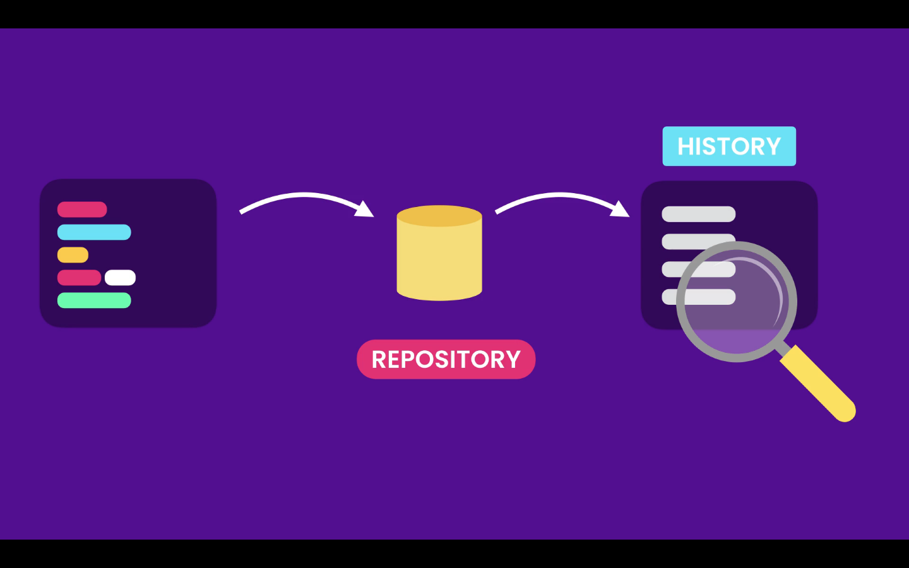
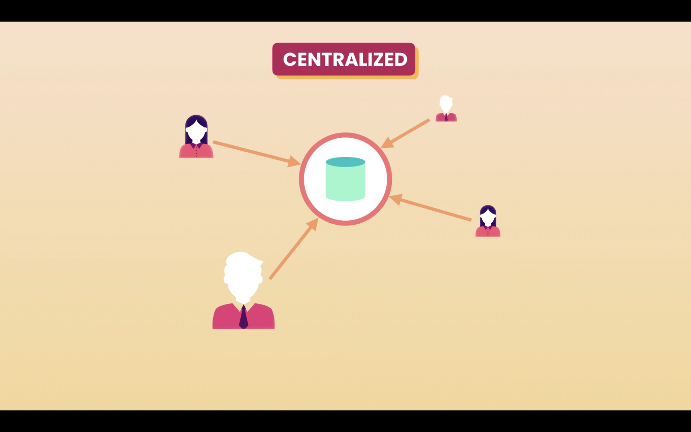
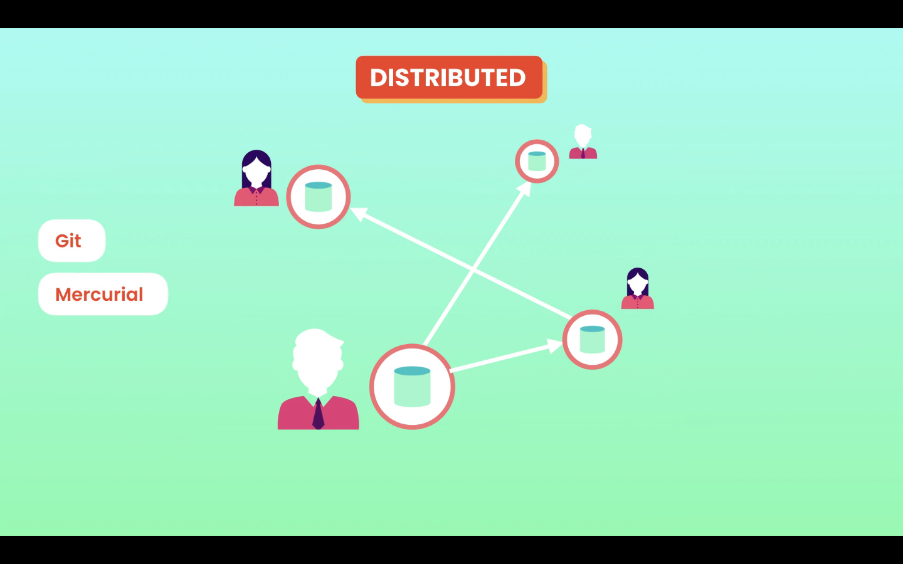
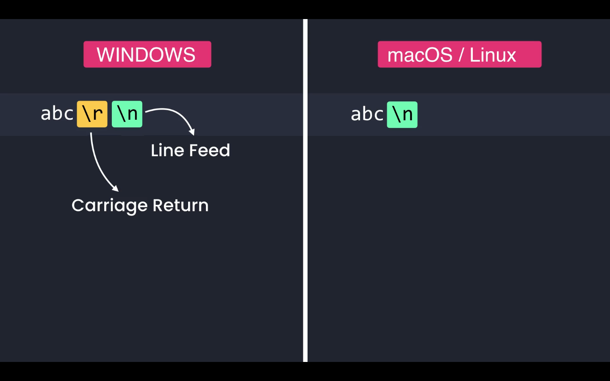

# 01- Introduction

## Course Topics

1. Fundamental concepts
2. Creating snapshots
3. Browsing project history
4. Branching & merging
5. Collaborating using GitHub
6. Rewriting history
# 02- How to Take This Course

# Mosh advice "DO NOT SKIT ANY LESSONS"!# 03- What is Git

## What is Git

Git is the most popular **Version Control System (VCS)** in the world.

Git records the changed made to our code in a special database called repository. It enable us to look into our project history, and see what changes where made, by whom, when and why. And if we mess something it we can easily revert our project back to an earlier state.

## Version Control Systems categories

### Centralized

In a **Centralized** system all team members connect to a central sever to get the latest copy of the code, and to share their changes with others.

Examples:

- Subversion
- Microsoft Team Foundation Server

The problem with a Centralized VCS is the single point of failure, if the server gos offline it is impossible to collaborate, or continue to take snapshots of the code.

### Distributed

In a **Distributed** system each team member as a full copy of the code and repository in ts machine, if the server goes offline they can keep on working

Examples:
- Git
- Mercurial

## Why Git?

Reasons to choose Git
- It is free
- Open Source
- Super Fast
- Scalable

Operations like branching and merging are painful in other VCS.# 04- Using Git

## Ways to use Git

### Command-line

The command-line is the most common, and probably the fastest way to use Git. Most GUI tools have limitations.

Sometimes GUI tools might not be available. Ins case for example if we connect to a server remotely and do not have permission to install a GUI tool.

### Code Editors & IDEs

Most code editors these days have built-in GUI tools and extensions to use Git.

- Vs code Extensions:
  - GitLens

### Graphical User Interfaces

In the [Git](https://git-scm.com/) website there is a [complete list of GUI tools](https://git-scm.com/download/gui/mac) for all the main platforms Mac, Linux and Windows.

The most popular ones are:

- [GitKraken](https://www.gitkraken.com/)
- [SourceTree](https://www.sourcetreeapp.com/)
# 05- Installing Git

## On macOS

In macOS it is recommended to use **Homebrew**.

Install **Homebrew**, and run the following command `brew install git`.
# 06- Configuring Git

## Setting

The fist time we use git we have to specify a few configuration setting.

- Settings:
- Name
- Email
- Default editor
- Line ending

## Settings Level

We can specify these configurations setting at 3 different levels

1. System ---> Apply to all users of the current computer.
2. Global ---> Apply to all repositories of the current user.
3. Local ---> Apply to the current repository.

## Command to apply settings

The command to apply setting is `git config --global <setting> <value>`. The flag `--global` specifies we are applying setting the the Global level.

- In the terminal type:
  - `git config --global user.name "Miguel Pimenta"`
  - `git config --global user.email my-email@code.com`
  - `git config --global core.editor "code --wait"` code for **VS Code** the `--wait` tells the terminal to wait until the window is closed.
  - `git config --global --edit` command to open the config file in the editor.

### End of lines

To manage end of line correctly we have to configure a property called `core.autocrlf`. These is a very import setting, so git can properly handle end of lines.

#### Windows

On Windows end of lines are marked with two special characters:

- Carriage Return: `\r`
- Line Feed: `\n`

`git config --global core.autocrlf true`

#### macOS / Linux

On macOS and Linux end of lines are marked with one special character:

- Line Feed: `\n`

`git config --global core.autocrlf input`

# 07- Getting Help

To get help about git command we can type a command followed by the `--help` flag. For example `git config --help` will give us the help topics about the `config` command. Press `space` to go to the next page and `esc` to exit.
\
If we use the flag `-h` we will get a shorter summary of the help topics.