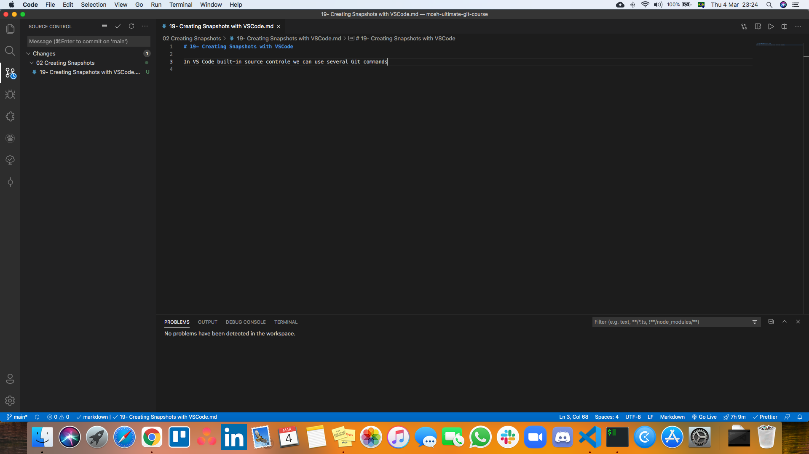

# 01- Introduction

Creating Snapshots and the fundamental concepts in Git
# 02- Initializing a Repository

## Initialize a git repository

Create a directory and put it any where. In may case `/Users/jmschp/code/mosh-ultimate-git-course/`.

Inside the directory run `git init`. This command should return the following message:

```zsh
❯ git init
Initialized empty Git repository in /Users/jmschp/code/mosh-ultimate-git-course/.git/
```

Inside our project folder the command `git init` as created a folder `.git`, by default it is hidden because we are not supposed to touch it. With the command `ls -a` we can see the git sub directory.

If we corrupt or delete this directory we lose the project history.
# 03- Git Workflow

## Workflow

In the daily work, we modify one or more files. When we believe that we reach a point that we want to record we commit those changes into the repository. Creating a commit it is like taking a snapshot of our project.

In Git there is a special area, an intermedial area, between the ***Working Directory*** and the ***Repository***. Its called the ***Staging*** or ***Index*** area. Files in these are are the one that will be in the next coommit.


First we add our changes to the **Staging Area**, and there we are able to review our changes, and them we make a commit. The commit will we save a snapshot to the repository. If some of the changes should not the saved in the next commit, we can remove that file from the **Staging Area**.

After we make the commit the **Staging Area** it is not emptied. What we have there now is the same snapshot the was record in the repository.

## Git commands

### git add

To add files to the staging area we use the `git add` command:

```zsh
git add file1 file2
```

We can add multiple files at the same time or use `git add .` to add all files, that have been changed, in the current directory recursively.

### git commit

To record the snapshot to the repository we use the `git commit` command, with the `-m` flag and a meaningful message, about the changes we have made.

```zsh
git commit -m "Initial commit"
```

Each commit contains a unique identifier, and also information of what was changed:

- ID
- Message
- Date / time
- Author
- Complete snapshot of the project

```zsh
commit f289d8ab48e5530b659931667edbc73e3eb10e29 (HEAD -> main, origin/main)
Author: Miguel Pimenta <my-email@code.com>
Date:   Sat Feb 27 23:15:48 2021 -0300

    First commit
```

Unlike other VCS Git stores, in each commit, the full snapshot of the project. Other VCS only store deltas or what was changed. Git those these in a very efficient manner, compressing the content and it does not store duplicates.
# 04- Staging Files

Git those not track files automatically we have to tell Git to track new files we add. Even when we start a new repository with `git init`, in project that already as several files, Git will only track them, we need to add them.

We can run the `git status` command to see the status of the **Working Directory** and **Staging Area**.

The output will be something like these:

```zsh
❯ git status
On branch main

Untracked files:
  (use "git add <file>..." to include in what will be committed)
	02 Creating Snapshots/04- Staging Files.md

nothing added to commit but untracked files present (use "git add" to track)
```

The above message is telling us we have untracked files.

Use the `git add` command to stage that file. In my case I have to quotation marks `""`, because there are whitespace, in the file path

```zsh
git add "02 Creating Snapshots/04- Staging Files.md"
```

We can also use patterns to add files.

```zsh
git add *.md
```

These will add all the files with an `.md` extension.

Now if we run `git status` again, we will have the following output:

```zsh
❯ git status
On branch main

Changes to be committed:
  (use "git restore --staged <file>..." to unstage)
	new file:   02 Creating Snapshots/04- Staging Files.md
```

If we make changes to the same file, after adding it to the **Staging Area** and run `git status`, we will have the following output:

```zsh
❯ git status
On branch main

Changes to be committed:
  (use "git restore --staged <file>..." to unstage)
	new file:   02 Creating Snapshots/04- Staging Files.md

Changes not staged for commit:
  (use "git add <file>..." to update what will be committed)
  (use "git restore <file>..." to discard changes in working directory)
	modified:   02 Creating Snapshots/04- Staging Files.md
```

We have the same file in the **Staging Area** and also marked as modified, and not staged. When we run the `git add` command Git took a snapshot of that file and added it to the **Staging Area**. So now we have a one version of the file in the staging area and another version in the **Working Directory**.

We can run `git add` one more time to add our changes to the **Staging Area**.

```zsh
❯ git status
On branch main
Your branch is up to date with 'origin/main'.

Changes to be committed:
  (use "git restore --staged <file>..." to unstage)
	new file:   02 Creating Snapshots/04- Staging Files.md
```
# 05- Committing Changes

Now that we have files in the **Staging Area**, we can commit them to the repository, with the command `git commit -m "My commit message"`

```zsh
❯ git status
On branch main

Changes to be committed:
  (use "git restore --staged <file>..." to unstage)
	new file:   02 Creating Snapshots/05- Committing Changes.md
```

With the command `git commit -m "New lesson started"` a snapshot will be saved to the repository.

```zsh
❯ git commit -m 'New lesson started'
[main cb4a472] New lesson started
 1 file changed, 4 insertions(+)
 create mode 100644 02 Creating Snapshots/05- Committing Changes.md
```

If we commit to more than one file, we will se the following message:

```zsh
❯ git commit -m 'Lesson completed'
[main bc32e03] Lesson completed
 2 files changed, 25 insertions(+)
 create mode 100644 02 Creating Snapshots/06- Committing Best Practices.md
 create mode 100644 02 Creating Snapshots/07- Skipping the Staging Area.md
```

When a short, one line, message is not sufficient, because we need to explain in detail the changes that where made we can use the command `git commit`, without the `-m "My message"` part. These will open the default editor with a file named `COMMIT_EDITMSG`.

In the first line we add a short description, ideal less than 80 characters, then we addd a line break and the more detail message. After we save and close the file the changes are committed. And we will hae in the terminal and ouput like the following:

```zsh
❯ git commit
[main e0a1a79] Continuing lesson 5 Committing Changes
 1 file changed, 18 insertions(+)
```

Example detailed commit:

```zsh
Continuing lesson 5 Committing Changes

Adding more details to the lesson number 5 Committing Changes of section 2 Creating Snapshots of the course The Ultimate Git Course.
Lectured by Mosh Hamedani.
# Please enter the commit message for your changes. Lines starting
# with '#' will be ignored, and an empty message aborts the commit.
#
# On branch main
# Your branch is ahead of 'origin/main' by 2 commits.
#   (use "git push" to publish your local commits)
#
# Changes to be committed:
#	modified:   02 Creating Snapshots/05- Committing Changes.md
#
# ------------------------ >8 ------------------------
# Do not modify or remove the line above.
# Everything below it will be ignored.
diff --git a/02 Creating Snapshots/05- Committing Changes.md b/02 Creating Snapshots/05- Committing Changes.md
index 10da8dc..21c6f07 100644
--- a/02 Creating Snapshots/05- Committing Changes.md
+++ b/02 Creating Snapshots/05- Committing Changes.md
@@ -2,3 +2,21 @@

 Now that we have files in the **Staging Area**, we can commit them to the repository, with the command `git commit -m "My commit message"`

+```zsh
+On branch main
+
+Changes to be committed:
+  (use "git restore --staged <file>..." to unstage)
+	new file:   02 Creating Snapshots/05- Committing Changes.md
+```
+
+With the command `git commit -m "New lesson started"` a snapshot will be saved to the repository.
+
+```zsh
+git commit -m 'New lesson started'
+[main cb4a472] New lesson started
+ 1 file changed, 4 insertions(+)
+ create mode 100644 02 Creating Snapshots/05- Committing Changes.md
+```
+
+When a short, one line, message is not sufficient, because we need to explain in detail the changes that where made we can use the command `git commit`, without the `-m "My message"` part. These will open the default editor.
\ No newline at end of file
```
# 06- Committing Best Practices

Our commits should not be to small neither to big. We do not want to commit every time we change a file, neither we want to wait until we implement a featured end to end before committing.

The all point of committing is to record checkpoint as we go.

**Commit often** when we believe the project or file is at a state we want to record.

For example if we are fixing a **Bug** than we find a **Typo** we should make separate commits. One for the **Bug** and another for the **Typo**.

## Wording

Most people like to use the present tense for commit messages. But other conventions can be used.

- PRESENT: Fix the bug
- PAST: Fixed the bug

## Conventional Commits

More in depth detail about commit messages in [Conventional Commits](https://www.conventionalcommits.org/en/v1.0.0/).
# 07- Skipping the Staging Area

We don't always have to stage our changes before committing. But do this only if we are sure our changes do not need to be reviewed.

To do this we run the command `git commit -a -m "My message"`, we supply the flag `-a`, that means all modified files. Or we can use `git commit -am "My message"`, combining `-a -m`.

```zsh
❯ gc -am 'Add details to lesson'
[main d0dd608] Add details to lesson
 1 file changed, 10 insertions(+)
```# 08- Removing Files

To delete a file from the project we use the same workflow. Just delete teh file normally, then we add the changes to the **Staging Area** and the we commit.

I have added and committed a file names `test.txt` and then deleted that file. When we run `git status`, we will get the following output:

```zsh
❯ git status
On branch main

Changes not staged for commit:
  (use "git add/rm <file>..." to update what will be committed)
  (use "git restore <file>..." to discard changes in working directory)
	modified:   02 Creating Snapshots/08- Removing Files.md
	deleted:    test.txt

no changes added to commit (use "git add" and/or "git commit -a")
```

In the example we have one file marked **modified** and another file marked as **deleted**.

If we run `git ls-files`we will see a list of files in the **Staging Area**, in my case:

```zsh
❯ git ls-files
01 Getting Started/01- Introduction.md
01 Getting Started/02- How to Take This Course.md
01 Getting Started/03- What is Git.md
01 Getting Started/04- Using Git.md
01 Getting Started/05- Installing Git.md
01 Getting Started/06- Configuring Git.md
01 Getting Started/07- Getting Help.md
01 Getting Started/images/03-01.png
01 Getting Started/images/03-02.png
01 Getting Started/images/03-03.png
01 Getting Started/images/06-01.png
02 Creating Snapshots/01- Introduction.md
02 Creating Snapshots/02- Initializing a Repository.md
02 Creating Snapshots/03- Git Workflow.md
02 Creating Snapshots/04- Staging Files.md
02 Creating Snapshots/05- Committing Changes.md
02 Creating Snapshots/06- Committing Best Practices.md
02 Creating Snapshots/07- Skipping the Staging Area.md
02 Creating Snapshots/08- Removing Files.md
02 Creating Snapshots/images/03-01.png
README.md
test.txt
```

Even after deleting `text.txt` from the **Working Directory** it still exist in the **Staging Area**.

Use `git add test.txt` to add that file to the staging area, to be committed.

```zsh
❯ git status
On branch main

Changes to be committed:
  (use "git restore --staged <file>..." to unstage)
	deleted:    test.txt

Changes not staged for commit:
  (use "git add <file>..." to update what will be committed)
  (use "git restore <file>..." to discard changes in working directory)
	modified:   02 Creating Snapshots/08- Removing Files.md
```

And now `git commit -m "Delete unnecessary file"`.

```zsh
❯ git commit -m "Delete unnecessary file"
[main 632354b] Delete unnecessary file
 1 file changed, 0 insertions(+), 0 deletions(-)
 delete mode 100644 test.txt
```

To remove a file we have to remove it both form the **Working Directory** and the **Staging Area**.

We can perform this operation with a single command `git rm test.txt`# 09- Renaming or Moving Files

When we rename a file and the run `git status` we will see the following output:

```zsh
❯ git status
On branch main

Changes not staged for commit:
  (use "git add/rm <file>..." to update what will be committed)
  (use "git restore <file>..." to discard changes in working directory)
	deleted:    02 Creating Snapshots/09- Renaming or Moving.md

Untracked files:
  (use "git add <file>..." to include in what will be committed)
	02 Creating Snapshots/09- Renaming or Moving Files.md

no changes added to commit (use "git add" and/or "git commit -a")
```

We have to changes and both are unstaged. One that is a delete operation, and a new untracked file.

If we both files to the staging area and run `git status` one more time, we will see the following output:

```zsh
❯ git status
On branch main

Changes to be committed:
  (use "git restore --staged <file>..." to unstage)
	renamed:    02 Creating Snapshots/09- Renaming or Moving.md -> 02 Creating Snapshots/09- Renaming or Moving Files.md
```

Git recognizes that we renamed the file ank marks it as renamed. Like in the delete operation, there is a Git command to rename files:

Then we commit the changes:

```zsh
❯ git commit -m 'Rename file'
[main aec2762] Rename file
 1 file changed, 0 insertions(+), 0 deletions(-)
 rename 02 Creating Snapshots/{09- Renaming or Moving Files.md => 09- Renaming or Moving.md} (100%)
```

```zsh
git mv <current file> <new name>
```

When we use the `git mv` command the changes are applied to both the **Working Directory** and the **Staging Area**.
# 10- Ignoring Files

In almost every project there are some files we do not want git to track them. Like for example `.log` files.

For example I added a `logs` folder and a `.log` file, in te root directory of the project. `git status` will mark the new folder as untracked.

```zsh
❯ git status
On branch main

Untracked files:
  (use "git add <file>..." to include in what will be committed)
	logs/

nothing added to commit but untracked files present (use "git add" to track)
```

To ignore files we must create a special file called `.gitignore` in the root of the project. This file as no name just as an extension. In that we will add the files or folders we want git to ignore.

We can include as many files or folder we want and use patterns as well like `*.log` to include all log files.

In this case we add the folder `logs/` to `.gitignore`. Now if we run `git status` we will no longer see the `logs/` folder, Instead it marks a new file `.gitignore`.

```zsh
❯ git status
On branch main
Your branch is ahead of 'origin/main' by 14 commits.
  (use "git push" to publish your local commits)

Untracked files:
  (use "git add <file>..." to include in what will be committed)
	.gitignore

nothing added to commit but untracked files present (use "git add" to track)
```

Now we must add and commit the `.gitignore` to the repository.

This only works if the file or directory to be ignored has not been included in the repository. If by accident we included a file in the repository and only later add it to `.gitignore`, Git is not going to ignore it, because it is already in the repository.

To ignore first we have to remove it from the **Staging Area**, with the `git rm --cached`. So lets suppose we had added the `logs/` folder the repository by accident. We can run:

```zsh
git rm --cached -r logs/
```

And them commit the changes. The `-r` flag is to allow recursive removal.

In GitHub repository [gitignore](https://github.com/github/gitignore) we can see a list of `.gitignore` templates for different programming languages.
# 11- Short Status

With the `git status` command we see the status of the **Staging Area** and **Working Directory**.

```zsh
❯ git status
On branch main
Your branch is ahead of 'origin/main' by 19 commits.
  (use "git push" to publish your local commits)

Changes not staged for commit:
  (use "git add <file>..." to update what will be committed)
  (use "git restore <file>..." to discard changes in working directory)
	modified:   02 Creating Snapshots/11- Short Status.md

Untracked files:
  (use "git add <file>..." to include in what will be committed)
	02 Creating Snapshots/12- Viewing Staged and Unstaged Changes.md

no changes added to commit (use "git add" and/or "git commit -a")
```

We can pass the flag `-s` to `git status -s` to have a shorter version.

```zsh
❯ git status -s
 M "02 Creating Snapshots/11- Short Status.md"
?? "02 Creating Snapshots/12- Viewing Staged and Unstaged Changes.md"
```

In this output we have two columns, the left column represents the **Staging Area** and the right column the **Working Directory**.

We have modified file `02 Creating Snapshots/11- Short Status.md`, thats why we have a red **`M`** in the right column, but the left column is empty because we don not have staged this modifications.

File `02 Creating Snapshots/12- Viewing Staged and Unstaged Changes.md` is a new file, that why we have red **`?`** in both columns.

Now if we run `git add "02 Creating Snapshots/11- Short Status.md"`and add this file to the **Staging Area**, the output of `git status -s` will be:

```zsh
❯ gi status -s
M  "02 Creating Snapshots/11- Short Status.md"
?? "02 Creating Snapshots/12- Viewing Staged and Unstaged Changes.md"
```

Now The **`M`** is green and is in the left column, meaning the modifications are in the **Staging Area**.

If we keep modifying the file and run `git status -s` we will se to **`M`** one green and another red. And if we add the new file to the **Staging Area** we will see a green **`A`**.

```zsh
❯ git status -s
MM "02 Creating Snapshots/11- Short Status.md"
A  "02 Creating Snapshots/12- Viewing Staged and Unstaged Changes.md"
```
# 12- Viewing Staged and Unstaged Changes

Before committing code it is a best practice to review your code. To do that we can use the `git diff` command.

## Comparing the **Staging Area**

To view changes in files that we have added to the **Staging Area** we run `git diff --staged`. This command will give us the following output:

````zsh
❯ git diff --staged
diff --git a/02 Creating Snapshots/12- Viewing Staged and Unstaged Changes.md b/02 Creating Snapshots/12- Viewing Staged and Unstaged Changes.md
index 561ffc0..3661360 100644
--- a/02 Creating Snapshots/12- Viewing Staged and Unstaged Changes.md
+++ b/02 Creating Snapshots/12- Viewing Staged and Unstaged Changes.md
@@ -1,3 +1,9 @@
 # 12- Viewing Staged and Unstaged Changes

+## git diff command

+Before committing code it is a best practice to review your code. To do that we can use the `git diff` command.
+
+```zsh
+git diff --staged
+```
\ No newline at end of file
````

In the first line we can see that the `diff` utility as called and with which arguments, what files we are comparing. The **`a/...`** is what we have in the last commit and **`b/...`** is what we currently have in the **Staging Area**.

```zsh
diff --git a/02 Creating Snapshots/12- Viewing Staged and Unstaged Changes.md b/02 Creating Snapshots/12- Viewing Staged and Unstaged Changes.md
```

After that we have a legend, changes in the old copy are marked with a red **`-`**, and changes to the new copy are marked with green **`+`**.

```zsh
--- a/02 Creating Snapshots/12- Viewing Staged and Unstaged Changes.md
+++ b/02 Creating Snapshots/12- Viewing Staged and Unstaged Changes.md
```

The legend is followed by a header, that tells us what parts of our file have been changed. The changes are split in chunks and there is a header for each chunk.

The **`-1,3`** referes to the old copy. It means starting from line one **`1`** three **`3`** lines have been extracted and shown here.

The **`+1,5`** referes to the new copy. It means starting from line one **`1`** five **`5`** lines have been extracted and shown here.

```zsh
@@ -1,3 +1,9 @@
```

## Comparing the **Working Directory**

To compare what we have in the working directory with what we have in the **Staging Area** we run `git diff`.

The output follows the same concept as `git diff --staged`.
# 13- Visual Diff Tools

The most popular visual `diff` tools out there are:

- KDiff3
- P4Merge
- WinMerge (Windows only)
- VS Code

To set VS Code as our default diff tool we have to set to Git configurations:

1. `git config --global diff.tool vscode` with this configuration we are giving a name to our default diff tool.
2. `git config --global difftool.vscode.cmd "code --wait --diff $LOCAL $REMOTE"` with this configuration we are telling git how to open VS Code. `code` is the VS code in `PATH` `--wait` to tell the terminal to wait for us to close VS Code, `--diff` We are telling VS Code we are comparing to files, and `$LOCAL $REMOTE` are to placeholders for the old file and new file.

Now we can run `git difftool` or `git difftool --staged` to open VS Code to see changes.
# 14- Viewing History

## Log

We can use the `git log` command to view the commit history. This command produces and output like the following. It is order by the newest to oldest commit.

```zsh
commit 3e3c6c3fced4e94579e7c506e742b480bd2c682c (HEAD -> main, origin/main)
Author: Miguel Pimenta <jmiguelpimenta@gmail.com>
Date:   Sun Feb 28 17:39:31 2021 -0300

    Start lesson

commit 529f5c183f9084caa3f5eafd2435f67094888a94
Author: Miguel Pimenta <jmiguelpimenta@gmail.com>
Date:   Sun Feb 28 17:13:15 2021 -0300

    Added new lessons
```

Each commit ad a unique identifier, and hexadecial, 40 character that git generates automatically.

```zsh
commit 3e3c6c3fced4e94579e7c506e742b480bd2c682c
```

Next to the first commit we have **`(HEAD -> main)`**:

- `HEAD` is a reference to the current branch.
- `main` beeing the current branch.

## Log one line

With the `git log --oneline` we can see a shorter version of the `log`command.

```zsh
3e3c6c3 (HEAD -> main, origin/main) Start lesson
529f5c1 Added new lessons
da5f08b Lessons start
12156df Add details to lesson
0ed2ae3 Lesson completed
ebdd235 Add gitignore
4dec09d Add more details to lesson
```

## Reverse history

The `--reverse` flag reverts the log display history. It can be applied both to the log command and to the log one line command.

- `git log --reverse`
- `git log --oneline --reverse`
# 15- Viewing a Commit

## Show commit

To view what was changed in a commit we can use the `git show` command. We have to pass teh commit as an argument. There are two ways to reference a commit:

1. By the unique identifier, for example `git show 3e3c6c3`. We don't have to type all the characters, we can type fewer character as long they are unique.
2. Another way is using the `HEAD` pointer. `HEAD` is in front of the last commit, so we can type how many steps we want to go back `git show HEAD~2`, for example 2.

This will produce a similar output to `git diff`.

```zsh
commit da5f08b76c559362400177e88d3a01b6d7511531
Author: Miguel Pimenta <jmiguelpimenta@gmail.com>
Date:   Sun Feb 28 16:52:55 2021 -0300

    Lessons start

diff --git a/02 Creating Snapshots/11- Short Status.md b/02 Creating Snapshots/11- Short Status.md
new file mode 100644
index 0000000..3b350e3
--- /dev/null
+++ b/02 Creating Snapshots/11- Short Status.md
@@ -0,0 +1,2 @@
+# 11- Short Status
+
```

## Show commit single file

If we want to see the exact version of a file saved in commit instead of seeing the differences we can use `git show HEAD~1:README.md`. So the `git show` command followed by `:`and the path to a file, in this example `README.md`, or another example, `git show HEAD~1:"02 CreatingSnapshots/12- Viewing Staged and Unstaged Changes.md"`.

## Show commit all files and directories

If we want to see all the files and directories in a commit we use `ls-tree`. A **tree** is a data structure for representing hierarchical information. These trees can have nodes and the nodes can have children. If we use `git ls-tree HEAD~1`, we will have an output like this:

```zsh
❯ git ls-tree HEAD~1
100644 blob 333c1e910a3e2bef1b9d0d4587392627d8388974    .gitignore
040000 tree 4c24e363fb92a146d90b33f5e6be484eda876cb1    01 Getting Started
040000 tree fedd8b67c40b90365ca1b2fc1357b15a56b8c9b6    02 Creating Snapshots
100644 blob abefdb35d01f55ffdabca93f53748b84f9d10e14    README.md
```

Files are represented using `blob` and directories are represented by `tree`. All of theses are object saved in git database. The `333c1e910a3e2bef1b9d0d4587392627d8388974` is a unique identifier of the corresponding file. We can use this identifier to vew the content of the file.

We can use `git show 333c1e` to view the content of the `.gitignore`, in that commit.

If we run this command on a `tree` like for instance `git show 4c24` we will get:

```zsh
tree 4c24

01- Introduction.md
02- How to Take This Course.md
03- What is Git.md
04- Using Git.md
05- Installing Git.md
06- Configuring Git.md
07- Getting Help.md
images/
```

## Git objects

Using `git show` we can view **Git Objects**, these objects can be:

- Commits
- Blobs (files)
- Tree (directories)
- Tags
# 16- Unstaging Files

When we want to unstage a file (remove the file from the **Staging Area**), in other word undo the `git add` command, we use the `git restore --staged`command. We can pass to it as arguments a specific file or multiple files, with a `.` (dot) for all files, or patterns like for example `*.txt` for all text files.

In this example I have the `02 Creating Snapshots/16- Unstaging Files.md` file changes in the **Staging Area**. We can see that with `git status` the file is marked as modified.

```zsh
❯ git status
On branch main

Changes to be committed:
  (use "git restore --staged <file>..." to unstage)
    modified:   02 Creating Snapshots/16- Unstaging Files.md
```

Running `git restore --staged "02 Creating Snapshots/16- Unstaging Files.md"` will remove this changes from the **Staging Area**.

When we run `git status` again, we can see the changes are not staged for commit.

```zsh
❯ git status
On branch main

Changes not staged for commit:
  (use "git add <file>..." to update what will be committed)
  (use "git restore <file>..." to discard changes in working directory)
    modified:   02 Creating Snapshots/16- Unstaging Files.md

no changes added to commit (use "git add" and/or "git commit -a")
```

When we run the `git restore --staged` git removes that file from the **Staging Area** and places there the copy from the last commit with that file.
# 17- Discarding Local Changes

When we want to discard local changes, in other others, changes in the **Working Directory**, we use the `git restore`, without the `--staged` flag.

When we run this command, Git is going to take a copy from the next environment in this case the **Staging Area**, and copy it in the **Working Directory**.

We can pass to it as arguments a specific file or multiple files, with a `.` (dot) for all files, or patterns like for example `*.txt` for all text files.

In case of new files (untracked files), Git does not change anything, because it does not know where to get a previous version of this file, it does not exist in the **Staging Area** or **Repository**. To remove untracked files we can use `git clean` with the `-fd` flags, `-f` for force and `-d` for whole directories.

If we run this command without the flags on untracked files we will get a fat error:

```zsh
fatal: clean.requireForce defaults to true and neither -i, -n, nor -f given; refusing to clean
```

This is a way of git ro warns us that this can not be undone.
# 18- Restoring a File to an Earlier Version

Once git tracks a file it stores every version of that file in the database. With Git there are two way to restore a earlier version of file:

1. Restore a file to previous version
2. Undoing a commit

In this lesson we are going to look at restoring a file. For example if we delete a file by accident.

Using the `git rm` command I have deleted a file. And ist now marked as `deleted` in the **Staging Area**. We can see ti with `git status`

```zsh
❯ git status
On branch main

Changes to be committed:
  (use "git restore --staged <file>..." to unstage)
        deleted:    02 Creating Snapshots/17- Discarding Local Changes.md

Untracked files:
  (use "git add <file>..." to include in what will be committed)
        02 Creating Snapshots/18- Restoring a File to an Earlier Version.md
```

After committing `git commit -m 'delete file'`, and fi we do a `git log --oneline`

```zsh
b02e494 (HEAD -> main) delete file
cb02fd6 Lesson complete
9b67da8 Lesson start
001ce95 Lesson complete
0746554 Start lesson
[...]
```

We can recover that file with `git restore`. By default git will restore a file from the next environment, so if the file we want to restore is in the **Working Directory**, Git will restore it from the **Staging Area**, and if it is in the **Staging Area** Git will restore it from the repository, or last commit.

In this case with `git restore --source=HEAD~1 "02 Creating Snapshots/17- Discarding Local Changes.md"`, we override the default behavior and restore the last commit that is when we deleted the file. With `git status` we will see the recovered file marked as untracked.

```zsh
❯ git status
On branch main

Untracked files:
  (use "git add <file>..." to include in what will be committed)
        02 Creating Snapshots/17- Discarding Local Changes.md
        02 Creating Snapshots/18- Restoring a File to an Earlier Version.md

nothing added to commit but untracked files present (use "git add" to track)
```
# 19- Creating Snapshots with VSCode

In VS Code built-in source controle we can use several Git commands.



The view in the left panel is similar to the `git status` output.

If we hover the mouse hover a file we will see a **`+`** sign. That will add files to the **Staging Area**. If that file is already in the **Staging Area** a **`-`** sig will be displayed, to remove the file from the **Staging Area**.
