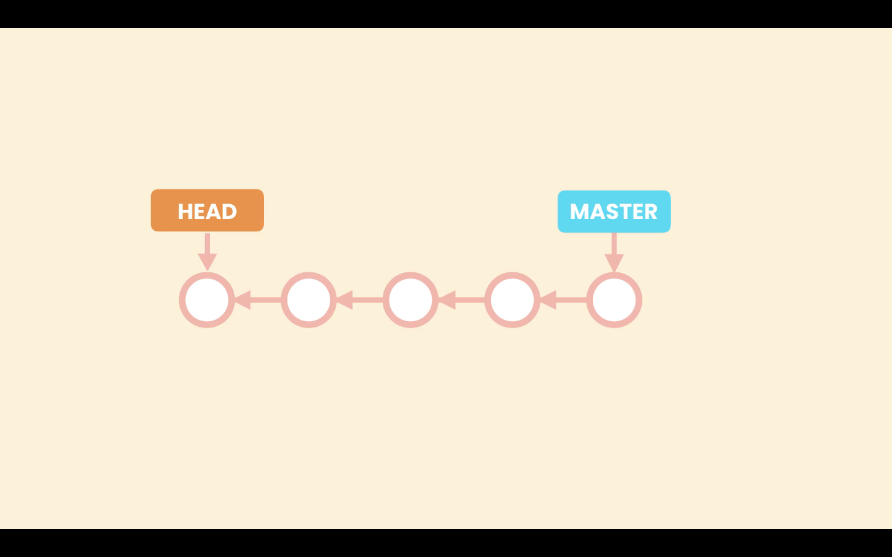
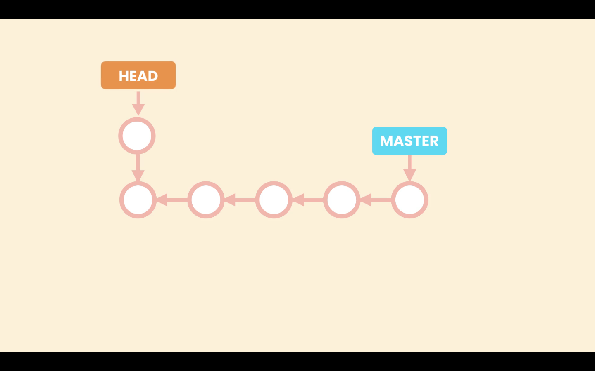
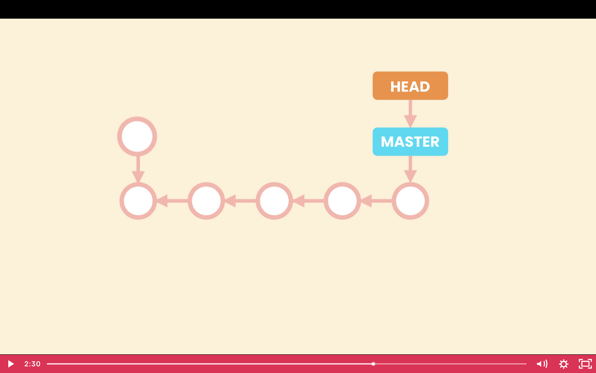

# 01- Introduction

In this section we will look into different ways to browse a project history.

1. Search for commits by author, date, message, etc
2. View a commit
3. Restore project to an earlier point
4. Compare commits
5. view the history of a file
6. Find a bad commit that introduced a bug
# 03- Viewing the History

We are going to view in more detail the `git log` command. Wit this command, as we know we can see in more detail the commit history. It gives us teh following output.

```zsh
commit b9e25dff4873a1db8cd615784a485d4ab7854e14 (HEAD -> main, origin/main)
Author: Miguel Pimenta <jmiguelpimenta@gmail.com>
Date:   Thu Mar 4 23:45:40 2021 -0300

    start new lesson

commit 9f618634b2592513a9da3da313f554abec2e18cc
Author: Miguel Pimenta <jmiguelpimenta@gmail.com>
Date:   Thu Mar 4 23:42:01 2021 -0300

    style: change tab to spaces

commit bf77b4e007ecaa30da382ff80e7afdc1fb1f6fc9
Author: Miguel Pimenta <jmiguelpimenta@gmail.com>
Date:   Thu Mar 4 23:35:58 2021 -0300

    lesson completed
```

Given we can have multiple pages of commits pressing`space` will take us to the nex page, we can also use the up and down arrows to navigate, and `q` to exit.

Apart fom the `--oneline` options that show a summary of the commits history, que can use other options.

## Option --stat

With the `--stat` options we can se the list of file that have been changed in each commit. The `git log --stat` will give the following output.

```zsh
commit b9e25dff4873a1db8cd615784a485d4ab7854e14 (HEAD -> main, origin/main)
Author: Miguel Pimenta <jmiguelpimenta@gmail.com>
Date:   Thu Mar 4 23:45:40 2021 -0300

    start new lesson

 03 Browsing History (44m)/01- Introduction.md | 1 +
 1 file changed, 1 insertion(+)

commit 9f618634b2592513a9da3da313f554abec2e18cc
Author: Miguel Pimenta <jmiguelpimenta@gmail.com>
Date:   Thu Mar 4 23:42:01 2021 -0300

    style: change tab to spaces

 02 Creating Snapshots/15- Viewing a Commit.md | 8 ++++----
 1 file changed, 4 insertions(+), 4 deletions(-)

commit bf77b4e007ecaa30da382ff80e7afdc1fb1f6fc9
Author: Miguel Pimenta <jmiguelpimenta@gmail.com>
Date:   Thu Mar 4 23:35:58 2021 -0300

    lesson completed

 02 Creating Snapshots/19- Creating Snapshots with VSCode.md    |   9 +++++++++
 02 Creating Snapshots/20- Creating Snapshots with GitKraken.md |   0
 02 Creating Snapshots/images/19-01.png                         | Bin 0 -> 375202 bytes
 3 files changed, 9 insertions(+)
```

Or combined with the `--online` option `git log --oneline --stat`.

```zsh
b9e25df (HEAD -> main, origin/main) start new lesson
 03 Browsing History (44m)/01- Introduction.md | 1 +
 1 file changed, 1 insertion(+)
9f61863 style: change tab to spaces
 02 Creating Snapshots/15- Viewing a Commit.md | 8 ++++----
 1 file changed, 4 insertions(+), 4 deletions(-)
bf77b4e lesson completed
 02 Creating Snapshots/19- Creating Snapshots with VSCode.md    |   9 +++++++++
 02 Creating Snapshots/20- Creating Snapshots with GitKraken.md |   0
 02 Creating Snapshots/images/19-01.png                         | Bin 0 -> 375202 bytes
 3 files changed, 9 insertions(+)
```

## Option --patch

With the `--path` option we can see the actual changes in each commit. The `git log --online --patch` wil give the following ouput.

```zsh
bf77b4e lesson completed
diff --git a/02 Creating Snapshots/19- Creating Snapshots with VSCode.md b/02 Creating Snapshots/19- Creating Snapshots with VSCode.md
new file mode 100644
index 0000000..bac12c2
--- /dev/null
+++ b/02 Creating Snapshots/19- Creating Snapshots with VSCode.md
@@ -0,0 +1,9 @@
+# 19- Creating Snapshots with VSCode
+
+In VS Code built-in source controle we can use several Git commands.
+
+
+
+The view in the left panel is similar to the `git status` output.
+
+If we hover the mouse hover a file we will see a **`+`** sign. That will add files to the **Staging Area**. If that file is already in the **Staging Area** a **`-`** sig will be displayed, to remove the file from the **Staging Area**.
diff --git a/02 Creating Snapshots/20- Creating Snapshots with GitKraken.md b/02 Creating Snapshots/20- Creating Snapshots with GitKraken.md
new file mode 100644
index 0000000..e69de29
diff --git a/02 Creating Snapshots/images/19-01.png b/02 Creating Snapshots/images/19-01.png
new file mode 100644
index 0000000..292335c
Binary files /dev/null and b/02 Creating Snapshots/images/19-01.png differ
```
# 04- Filtering the History

In a project with a long history we can have hundreds or even thousands of commits. We use we can filter commits, so we do not have to view the al history.

## Filter by last n commits `-number`

We can pass a number to the `git log` command. For example with `git log -3` we can view the last 3 commits. The following output is from the command `git log --oneline -3`.

```zsh
4acfee7 (HEAD -> main, origin/main) lesson complete
dd6b4b2 fix: typo
b9e25df start new lesson
```

## Filter by author `--author=`

With the option `--author=` we can filter commits by author, `git log --author="Miguel"`.

## Filter by date `--before` and or `--after`

Wit he option `--before` and or `--after` we can filter the commit history by date, we do not have to pass both options. For example `git log --oneline --after="2021-03-06"`. It is also possible to specify relative dates, like `git log --oneline --after="yesterday"`, `git log --oneline --after="one week ago"`, `git log --oneline --after="two day ago"`.

## Filter by message `--grep`

We can filter commits by keywords in their message with the `--grep` option. For example `git log --online --grep="typo"`. This will return all the commits tha have the word `typo` in their message. This command is case sensitive.

## Filter by content `-S`

We can filter commits by content of the file with the `-S` option. For instance if we need to find a commit that added or remove a certain function declaration,for example the function `hello()` we use `git log -S"hello()"`. Notice that we do not pass an `=` sign to the `-S` option. Here with the command `git log --oneline -S"VS Code"`, we can see all the commits that have the `VS Code` in the file content.

```zsh
4acfee7 (HEAD -> main, origin/main) lesson complete
bf77b4e lesson completed
15478b9 Lesson completed
f289d8a First commit
```

We could add the `--patch` option to see the actual changes made, `git log --oneline -S"VS Code" --patch`.

## Filter by commit range

It is also possible to filter a range of commits, using the commit hash `git log 15478b9..b02e494`.

## Filter by file

We can filter commits that applied changes to a particular file or several files, just by passing the name of the file, with the relative path at the end of the command, like so `git log -- "02 Creating Snapshots/16- Unstaging Files.md"`. The `--` double hyphens separating the command from the file is optional, but if we do not pass it, depending on the file name Git can throw an error of ambiguity. The file name should be the last option given to the command.# 05- Formatting the Log Output

## Option `--pretty=format:`

We can personalize the output of the log command with the option `git log --pretty:format:`. We must pass it a format string that where we can use plain text combined with placeholder that will be replaced by Git with information. In [Git PRETTY FORMATS](https://git-scm.com/docs/pretty-formats) we can see a list of all the place holders. We can also pass colors to the output

The following command (courtesy of [Le Wagon](https://www.lewagon.com/) bootcamp setup).

```zsh
git log --graph --pretty=format:'%Cred%h%Creset -%C(yellow)%d%Creset %s %Cgreen(%cr) %C(bold blue)<%an>%Creset' --abbrev-commit
```

Will give teh following output:

```zsh
* 4acfee7 - (HEAD -> main, origin/main) lesson complete (57 minutes ago) <Miguel Pimenta>
* dd6b4b2 - fix: typo (57 minutes ago) <Miguel Pimenta>
* b9e25df - start new lesson (3 days ago) <Miguel Pimenta>
* 9f61863 - style: change tab to spaces (3 days ago) <Miguel Pimenta>
* bf77b4e - lesson completed (3 days ago) <Miguel Pimenta>
* 0aa8fd5 - restore deleted file (3 days ago) <Miguel Pimenta>
* 40d94ee - deleted file (3 days ago) <Miguel Pimenta>
* 2d077eb - lessons complete (3 days ago) <Miguel Pimenta>
* b02e494 - delete file (3 days ago) <Miguel Pimenta>
* cb02fd6 - Lesson complete (5 days ago) <Miguel Pimenta>
* 9b67da8 - Lesson start (5 days ago) <Miguel Pimenta>
```
# 06- Aliases

We can set aliases from frequently used commands so we do not have to type them in the long form. That is done the config property `alias`, like so.

```zsh
git config --global alias.l "log --graph --pretty=format:'%Cred%h%Creset -%C(yellow)%d%Creset %s %Cgreen(%cr) %C(bold blue)<%an>%Creset' --abbrev-commit"
```

We we are setting the `l` as an alias of `log --graph --pretty=format:'%Cred%h%Creset -%C(yellow)%d%Creset %s %Cgreen(%cr) %C(bold blue)<%an>%Creset' --abbrev-commit`.

So ater setting that property we can use `git l`.
# 07- Viewing a Commit

As we seen before we can use `git show` to the infos about a specific commit. [Section: Creating Snapshot - Lesson: 15- Viewing a Commit](https://github.com/jmschp/mosh-ultimate-git-course/blob/9f618634b2592513a9da3da313f554abec2e18cc/02%20Creating%20Snapshots/15-%20Viewing%20a%20Commit.md)

## Final version of a file

We can see the final version of a file in a particular commit with the `git show HEAD~n:<path to the file>`. For example `git show HEAD~2:"02 Creating Snapshots/12- Viewing Staged and Unstaged Changes.md`. In here are 2 commits before `HEAD` which is the last commit.

## Files changed in a commit `--name-only`

To view the files that were changed in a given commit we use `git show HEAD~4 --name-only`, The output is something like:

```zsh
commit bf77b4e007ecaa30da382ff80e7afdc1fb1f6fc9
Author: Miguel Pimenta <jmiguelpimenta@gmail.com>
Date:   Thu Mar 4 23:35:58 2021 -0300

    lesson completed

02 Creating Snapshots/19- Creating Snapshots with VSCode.md
02 Creating Snapshots/20- Creating Snapshots with GitKraken.md
02 Creating Snapshots/images/19-01.png
```

## Files changed in a commit `--name-status`

Using the option `--name-status`, we have a similar output than above but wit information about the file, if it was added, modified, deleted or renamed.

```zsh
commit bf77b4e007ecaa30da382ff80e7afdc1fb1f6fc9
Author: Miguel Pimenta <jmiguelpimenta@gmail.com>
Date:   Thu Mar 4 23:35:58 2021 -0300

    lesson completed

A       02 Creating Snapshots/19- Creating Snapshots with VSCode.md
A       02 Creating Snapshots/20- Creating Snapshots with GitKraken.md
A       02 Creating Snapshots/images/19-01.png
```
# 08- Viewing the Changes Across Commits

To see what has been changed across a range of commits we use the `diff` command. For example `gif diff HEAD~2 HEAD`, will return all the changes from the last two commits `HEAD~2` until the most recent commit `HEAD`.

We can add a particular file to that command to only see the changes made to that file, like `git diff HEAD~2 HEAD "03 Browsing History (44m)/06- Aliases.md"`

Like with the `log` command, we can pass `--name-only` and `--name-status` here to see the list of file that have been changed.
# 09- Checking Out a Commit

When we need to see the complete project in a given point in time we can check out a given commit, and it will restore our **Working Directory** to that point in time. Using the command `git checkout <commit>`. For example `git checkout 12156df`.

This will bring a warning:

```zsh
Note: switching to 'b9e25df'.

You are in 'detached HEAD' state. You can look around, make experimental
changes and commit them, and you can discard any commits you make in this
state without impacting any branches by switching back to a branch.

If you want to create a new branch to retain commits you create, you may
do so (now or later) by using -c with the switch command. Example:

  git switch -c <new-branch-name>

Or undo this operation with:

  git switch -

Turn off this advice by setting config variable advice.detachedHead to false

HEAD is now at b9e25df start new lesson
```

## Detached HEAD state

In Git each commit is pointing to the last commit. That is how Git maintains history.


Until now all the commits created are part of a branch, the `master` or `main`. The way Git represents branches is using a pointer, so `master` is pointing to the last commit created. As we create new commits master moves forward to point to the last commit.


Because we can have multiple branches Git needs to know in which branch we are working at the moment. To do that Git uses another special pointer called `HEAD`, so `HEAD` points to the current branch we are working on. In this case `master`. We have seen this in the `git log` command **`(HEAD -> main)`**.

```zsh
2ee3bb6 (HEAD -> main) add details to lesson
18869aa lesson complete
f2150f7 lesson complete
4acfee7 lesson complete
```

When we checkout a particular commit, the `HEAD` pointer will move to that commit, thats is what is called a `detached HEAD`. `HEAD` is not pointing to a branch but is pointing to a specific commit.



In this situation we should not create new commits. If we make changes and create a new commit, that commit will be added where the `HEAD` pointer is at the moment. But eventual we will attach the HEAD pointer to a branch, so the commit created it is not reachable by any other commit or pointer, ist like a dead commit. Git checks for commits like these periodically and removes them to save space.



Lost commit.



If we run `git log --oneline --all` command while in a detached `HEAD` state we can see the `master`(main in my case) pointing to the last commit and `HEAD` point to the specific commit. If we use `git log --oneline` without the the `--all` flag, we will not see the commits after made after the commit `HEAD` is pointing to.

```zsh
ebbd4b1 (main) add details to lesson
66cf5ab add details to lesson
2ee3bb6 add details to lesson
18869aa lesson complete
f2150f7 (HEAD) lesson complete
4acfee7 lesson complete
dd6b4b2 fix: typo
b9e25df start new lesson
9f61863 style: change tab to spaces
[...]
```

To attache the `HEAD` pointer to the branch, use `git checkout <name of the branch>` in this case `git checkout main`.
# 10- Finding Bugs Using Bisect

Git provides a great tool to find bugs quickly **Bisect**.

Image that we have a bug in an application, but we do not know where the bug was introduced. Using the **Bisect** to we can narrow our search.

First we have to tell it that the current state, being the last commit, is a bad commit. And them we have to give it a good commit, as teh good state.

Running `git log --oneline`, let say that the good state or good commit is `9f61863`. at that point in time the application was ok.

```zsh
ebbd4b1 (HEAD -> main) add details to lesson
66cf5ab (origin/main) add details to lesson
2ee3bb6 add details to lesson
18869aa lesson complete
f2150f7 lesson complete
4acfee7 lesson complete
dd6b4b2 fix: typo
b9e25df start new lesson
9f61863 style: change tab to spaces
bf77b4e lesson completed
[...]
```

So first we run `git bisect start`, this will initialize the the **`bisect`** operation.

Then we tell it the bad commit, witch is the current one, run `git bisect bad`.

Then we give it a good commit run `git bisect good 9f61863`. This will give the following output:

```zsh
❯ git bisect good 9f61863
Bisecting: 4 revisions left to test after this (roughly 2 steps)
[18869aaa853d0e3b2383a9104184f05eadd61722] lesson complete
```

If we run the `git log --oneline --all`. We can see that the `HEAD` is detached. So Git as made a checkout to the middle of the history, between the bad and good commit we gave `bisect`. So our **Working Directory** will be restored to that point in time.

```zsh
54b967c (main, refs/bisect/bad) add details to lesson
9325623 add details to lesson
ebbd4b1 add details to lesson
66cf5ab add details to lesson
2ee3bb6 add details to lesson
18869aa (HEAD) lesson complete
f2150f7 lesson complete
4acfee7 lesson complete
dd6b4b2 fix: typo
b9e25df start new lesson
9f61863 (refs/bisect/good-9f618634b2592513a9da3da313f554abec2e18cc) style: change tab to spaces
bf77b4e lesson completed
0aa8fd5 restore deleted file
40d94ee deleted file
2d077eb lessons complete
```

At this point we can run our application and automated tests to see if the problem is still there. If the bug persists it means that it is somewhere between commit `18869aa` and commit `b9e25df`. If the bug is gone it means it was introduced in the other half.

Suppose this was a good commit, so we run `git bisect good`. Meaning the bug is in the upper half. Between commit `2ee3bb6` and the latest commit. This will have the following output:

```zsh
❯ git bisect good
Bisecting: 2 revisions left to test after this (roughly 1 step)
[66cf5ab9240156e59aca2923bc0d73a6583af68d] add details to lesson
```

So now running `git log --oneline --all`, Git as moved the `HEAD` to the middle of the half that should have the problem.

```zsh
54b967c (origin/main, main, refs/bisect/bad) add details to lesson
9325623 add details to lesson
ebbd4b1 add details to lesson
66cf5ab (HEAD) add details to lesson
2ee3bb6 add details to lesson
18869aa (refs/bisect/good-18869aaa853d0e3b2383a9104184f05eadd61722) lesson complete
f2150f7 lesson complete
4acfee7 lesson complete
dd6b4b2 fix: typo
b9e25df start new lesson
9f61863 (refs/bisect/good-9f618634b2592513a9da3da313f554abec2e18cc) style: change tab to spaces
bf77b4e lesson completed
0aa8fd5 restore deleted file
40d94ee deleted file
2d077eb lessons complete
```

Now `HEAD` in the `66cf5ab` commit, lets image we run our test and the bug is still there, so this is a bad commit, we run `git bisect bad`. The out put is:

```zsh
❯ git bisect bad
Bisecting: 0 revisions left to test after this (roughly 0 steps)
[2ee3bb6004b4f8e681693b35f81df16ae425fa10] add details to lesson
```

With `git log --oneline --all`, we see now that we have one commit marked as **`(refs/bisect/bad)`**, and Git as moved `HEAD` to the `2ee3bb6` commit. So the bug must be in commit `66cf5ab` or `2ee3bb6`.

```zsh
54b967c (origin/main, main) add details to lesson
9325623 add details to lesson
ebbd4b1 add details to lesson
66cf5ab (refs/bisect/bad) add details to lesson
2ee3bb6 (HEAD) add details to lesson
18869aa (refs/bisect/good-18869aaa853d0e3b2383a9104184f05eadd61722) lesson complete
f2150f7 lesson complete
4acfee7 lesson complete
dd6b4b2 fix: typo
b9e25df start new lesson
9f61863 (refs/bisect/good-9f618634b2592513a9da3da313f554abec2e18cc) style: change tab to spaces
bf77b4e lesson completed
0aa8fd5 restore deleted file
40d94ee deleted file
2d077eb lessons complete
```

Let's suppose the bug is still there, meaning the bug was introduced in commit `2ee3bb6`. So we run `git bisect bad`. Git will output the info about that commit like the following example:

```zsh
❯ git bisect bad
2ee3bb6004b4f8e681693b35f81df16ae425fa10 is the first bad commit
commit 2ee3bb6004b4f8e681693b35f81df16ae425fa10
Author: Miguel Pimenta <jmiguelpimenta@gmail.com>
Date:   Sun Mar 7 15:37:14 2021 -0300

    add details to lesson

 03 Browsing History (44m)/09- Checking Out a Commit.md | 3 ++-
 1 file changed, 2 insertions(+), 1 deletion(-)
```

After we are done we have to attach the `HEAD` pointer to the branch with the command `git bisect reset`.

With `git bisect` we can split our history in half, to see various commit, and find the commit that introduced a problem.
# 11- Finding Contributors Using Shortlog

If we need to see everyone that made contributions to our project we can use the `git shortlog` command. This will output the following:

```zsh
Fernando Moraes (14):
      html do index/show
      Merge branch 'main' of github.com:jmschp/kids-time into main
      index e show html
 [...]
      bttns
      atualicazao seed
      bttns com link, pagina activitys

Miguel Pimenta (135):
      Initial commit with minimal template from https://github.com/lewagon/rails-templates
      Initialized rails app
      Added and configured Devise gem
      Configured Cloudinary
      Added Models Activity Order, and added columns to users
 [...]
```

The contributor, the number of commits and the commits messages.

The command accepts various options, for example `git shortlog -n` will sort output according to the number of commits per author.

The command `git shortlog -s`, suppress commit descriptions, only provides commit count and authors.

We can also filter using `--before=` and `--after=`, to view teh contributor in a date range.
# 12- Viewing the History of a File

To view a history of a particular file we run `git log <file>`
# 13- Restoring a Deleting File

If we want to recover a deleted file we can do it by checkout the previous commit, of the one that deleted the file.

For example I have run `git rm "03 Browsing History (44m)/10- Finding Bugs Using Bisect.md"` and delete this file. Wih `git log --oneline`, we can see that the file was deleted in the last commit.

```zsh
dacc1ec (HEAD -> main) delete file
33bceb5 start new lesson
1ce178a lesson complete
b5f716e lesson complete
54b967c add details to lesson
```

Now to recover that file we checkout the previous commit (or teh parent commit), in this case `33bceb5`, passing the nane file.

```zsh
git checkout 33bceb5 -- "03 Browsing History (44m)/10- Finding Bugs Using Bisect.md"
```

After running this command we can see that we have in the **Staging Area** one new file with `git status`.

```zsh
❯ git status
On branch main

Changes to be committed:
  (use "git restore --staged <file>..." to unstage)
	new file:   03 Browsing History (44m)/10- Finding Bugs Using Bisect.md

Untracked files:
  (use "git add <file>..." to include in what will be committed)
	03 Browsing History (44m)/13- Restoring a Deleting File.md
```
# 14- Finding the Author of Line Using Blame

Git Blame is a command to find the author of a crappy line of code. Run `git blame <file>`

```zsh
git blame "03 Browsing History (44m)/13- Restoring a Deleting File.md"
```

This command will give an output like the following:

````zsh
b89cef85 (Miguel Pimenta 2021-03-08 23:30:10 -0300  1) # 13- Restoring a Deleting File
b89cef85 (Miguel Pimenta 2021-03-08 23:30:10 -0300  2)
b89cef85 (Miguel Pimenta 2021-03-08 23:30:10 -0300  3) If we want to recover a deleted file we can do it by checkout the previous commit, of the one that deleted the file.
b89cef85 (Miguel Pimenta 2021-03-08 23:30:10 -0300  4)
b89cef85 (Miguel Pimenta 2021-03-08 23:30:10 -0300  5) For example I have run `git rm "03 Browsing History (44m)/10- Finding Bugs Using Bisect.md"` and delete this file. Wih `git log --oneline`, we can see that the file was deleted in the last commit.
b89cef85 (Miguel Pimenta 2021-03-08 23:30:10 -0300  6)
b89cef85 (Miguel Pimenta 2021-03-08 23:30:10 -0300  7) ```zsh
b89cef85 (Miguel Pimenta 2021-03-08 23:30:10 -0300  8) dacc1ec (HEAD -> main) delete file
b89cef85 (Miguel Pimenta 2021-03-08 23:30:10 -0300  9) 33bceb5 start new lesson
````

For each line of code in the file we can see

1. The commit ---> b89cef85
2. The author ---> Miguel Pimenta
3. Date & Time ---> 2021-03-08 23:30:10 -0300
4. Line number ---> 1
5. And the code it self.

## Git blame with email `-e`

We can use other option with `git blame`, for example `-e` will also return the email of the author.

```zsh
git blame -e "03 Browsing History (44m)/13- Restoring a Deleting File.md"
```

```zsh
b89cef85 (<jmiguelpimenta@gmail.com> 2021-03-08 23:30:10 -0300  1) # 13- Restoring a Deleting File
b89cef85 (<jmiguelpimenta@gmail.com> 2021-03-08 23:30:10 -0300  2)
b89cef85 (<jmiguelpimenta@gmail.com> 2021-03-08 23:30:10 -0300  3) If we want to recover a deleted file we can do it by checkout the previous commit, of the one that deleted the file.
b89cef85 (<jmiguelpimenta@gmail.com> 2021-03-08 23:30:10 -0300  4)
b89cef85 (<jmiguelpimenta@gmail.com> 2021-03-08 23:30:10 -0300  5) For example I have run `git rm "03 Browsing History (44m)/10- Finding Bugs Using Bisect.md"` and delete this file. Wih `git log --oneline`, we can see that the file was deleted in the last commit.
```

## Git blame filter by lines `-L`

We can filter the lines we want using the `-L` flag and we have to pass to it the start line and end line separated by a comma.

```zsh
git blame -L 1,3 "03 Browsing History (44m)/13- Restoring a Deleting File.md"
```

The above example will return the first three lines of code.

```zsh
b89cef85 (Miguel Pimenta 2021-03-08 23:30:10 -0300 1) # 13- Restoring a Deleting File
b89cef85 (Miguel Pimenta 2021-03-08 23:30:10 -0300 2)
b89cef85 (Miguel Pimenta 2021-03-08 23:30:10 -0300 3) If we want to recover a deleted file we can do it by checkout the previous commit, of the one that deleted the file.
```
# 15- Tagging

Tags are use to mark a certain point in the project. Most of the times they are used to mark release version, like v1.0.

There are two type of tags lightweight, and annotated tag. The lightweight as only the tag name, and a annotated tag has more properties, like tagger name, email and message. Because a annotated tag can have more info they are preferes to lightweight.

## Tagging in the last commit

If we want to tag the last commit run `git tag <name of the tag>`

```zsh
git tag v1.0
```

## Tagging an earlier commit

To tag an earlier commit we have to pass the commit after the tag like `git tag <name of teh tag> <referent to commit>`.

```zsh
git tag v1.0 b4ef25f
```

With `git log --oneline` we can see the tag.

```zsh
b89cef8 (HEAD -> main) lesson complete
b4ef25f (tag: v1.0) restore file
dacc1ec delete file
33bceb5 start new lesson
1ce178a lesson complete
b5f716e lesson complete
```

## Referente a commit using a tag

It is also possible to reference a commit by it tag.

```zsh
git checkout v1.0
```

## See all the tags

To see all the tag in the project run:

```zsh
git tag
```

## Annotated tag `-a`

To create a annotated tag we use the option `-a`, followed by the tag name and then `-m` and a message.

```zsh
git tag -a v1.2 -m 'Release version 1.1'
```

## Tags messages `-n`

To view the tags and messages use the `-n`option.

```zsh
git tag -n
```

This will ouput something like the following example.

```zsh
v1.0            restore file
v1.2            Release version 1.2
```

The lightweight tag is associated with the commit message that it point to. And the annotated tag has a custom message.

## Show Tag

Run `git show <tag name>` to view all the infos of that tag. Similar to `git show <commit>`. If the command is ran on an annotated tag besides the commit info we also have the tag info.

```zsh
tag v1.2
Tagger: Miguel Pimenta <jmiguelpimenta@gmail.com>
Date:   Tue Mar 9 00:00:03 2021 -0300

Release version 1.1

commit b89cef852dde2c83d81609d981c35ce6f8b7fba0 (HEAD -> main, tag: v1.2)
Author: Miguel Pimenta <jmiguelpimenta@gmail.com>
Date:   Mon Mar 8 23:30:10 2021 -0300

    lesson complete
```

## Delete a tag `-d`

To delete a tag use the `-d` option.

```zsh
git tag -d v1.0
```

This returns the deleted tag like so:

```zsh
Deleted tag 'v1.0' (was b4ef25f)
```
