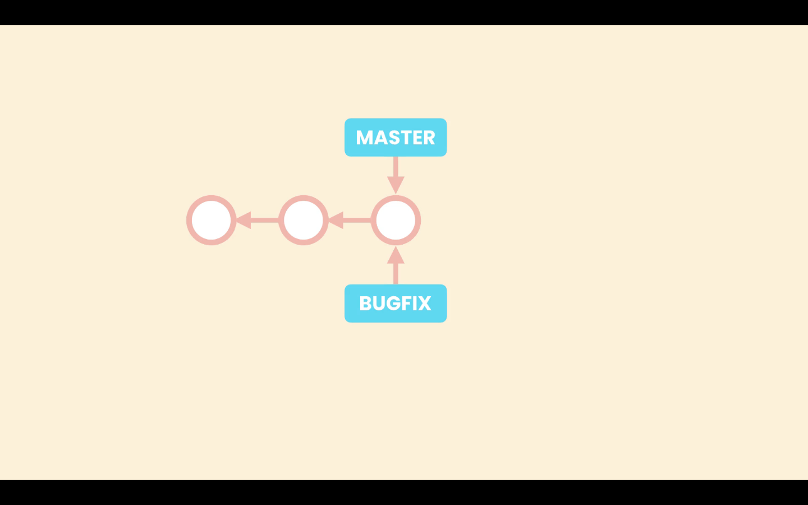
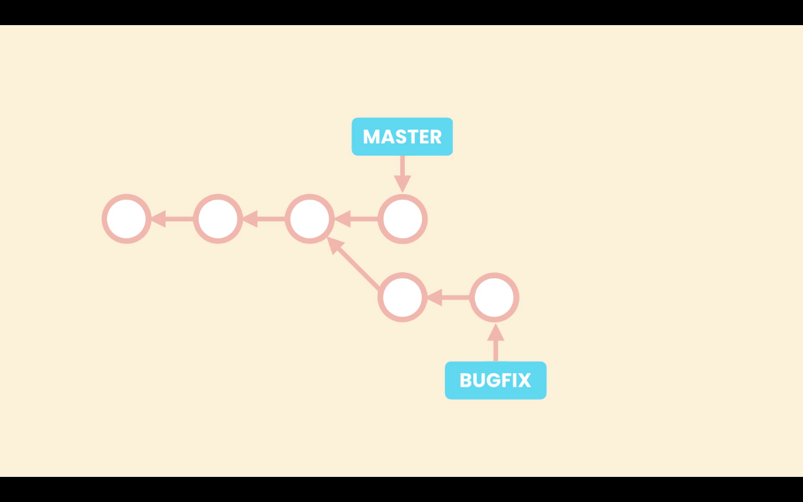
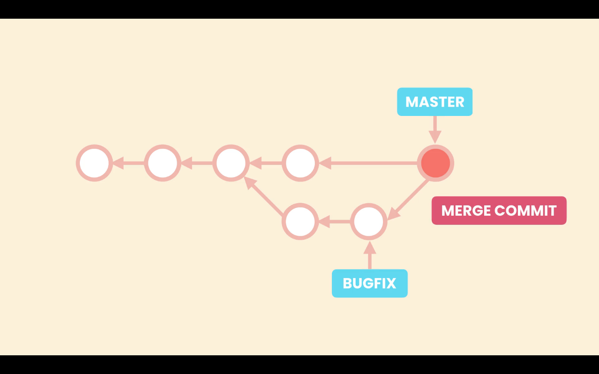
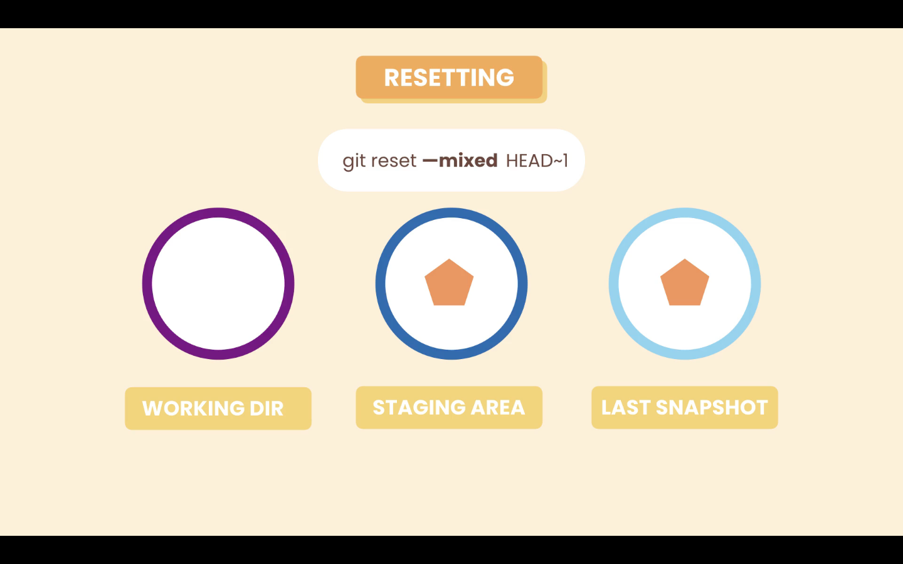
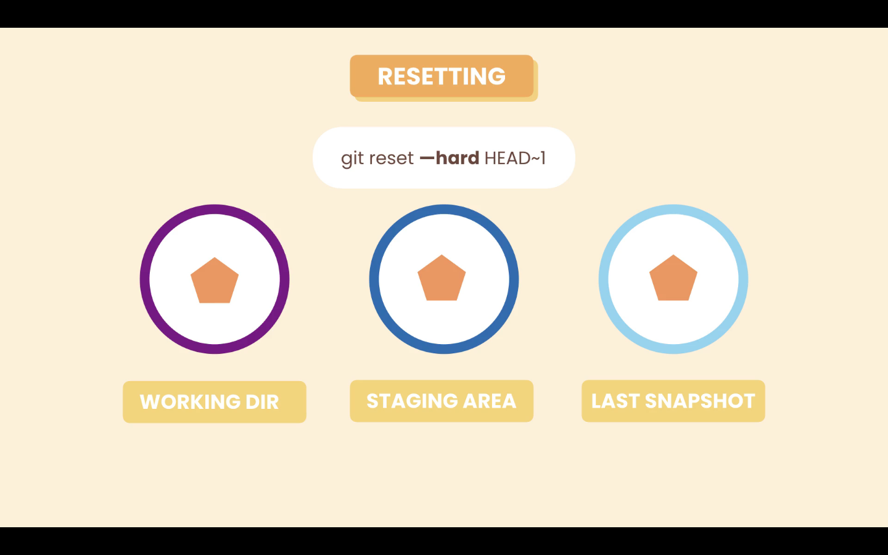

# 1- Introduction

In this section we will cover.

1. Use branches
2. Compare branches
3. Merge branches
4. Resolve conflicts
5. Udo a faulty merge
6. Essential tools (stashing, cherry picking)
# 02- What are Branches

Branches allows us to work in an isolated environment from the main line. So branches are a kind of separate isolated workspace.


The principal line of work (branch) is called ***master*** or ***main***. When we need to work, for example, on a new feature we can create a new branch to work on that feature. And when we are done we merge the new feature branch into the ***main*** branch.

## How does git manages branches

When we create a new branch Git creates a new pointer for that branch. When we work in that branch and make new commits Git moves that pinter forward, and the master pointer stays where it is. This way Git knows the latest code in each branch. To know in which branch we are working on, Git uses the **HEAD** pointer, when we switch banchs Git points the **HEAD** pointer to the branch we want to work on, and updates the **Working Directory** accordingly.


# 04- Working with Branches

## Create new branch

To create a new branch run `git branch <name-of-branch>`

```zsh
git branch bugfix
```

## View Branches

To view all the available branch run `git branch`

```zsh
❯ git branch
  bugfix
* main
```

The `*` in front of the **_main_** means that at the moment we are in that branch. It is also possible to view the current branch with `git status`.

## Change branches

Nowadays the command to changes branches is `git switch <name-of-branch>`. It used to be `git checkout <name-of-branch>`, it is possible to still use the old command.

```zsh
❯ git switch bugfix
Switched to branch 'bugfix'
```

## Rename a branch `-m`

The branches name should represent the work that is being performed on it. To rename a branch run the command `git branch -m <old-name> <new-name>`

```zsh
git branch -m bugfix bugfix-signup-form
```

## Commit to branch

When we commit to a branch this branch moves forward and the **_main_** branch stays where it is, we can see that with `git log --oneline`. The **_HEAD_** pointer will be pointing to the new branch head of **_main_**.

```zsh
54bb974 (HEAD -> bugfix-signup-form) start new lesson
6d5df20 (main) lesson complete
b89cef8 lesson complete
b4ef25f restore file
dacc1ec delete file
33bceb5 start new lesson
1ce178a lesson complete
b5f716e lesson complete
```

If we switch back to **_main_** our **Working Directory** will be restored to that point.

## Delete a brach `-d` or `-D`

To delete, first we need to change to a different branch usually ***main***, then we use the `-d` option, but if this branch as unmerged changes with ***main***, Git will throw an error warning us.

```zsh
❯ git branch -d bugfix-signup-form
error: The branch 'bugfix-signup-form' is not fully merged.
If you are sure you want to delete it, run 'git branch -D bugfix-signup-form'.
```

To force the deletion use the `git branch -D bugfix-signup-form`.
# 05- Comparing Branches

## Log differences

We can compare branches to see different commits between them. To do so use the command `git log <first-branch>..<second-branch>`. This will return all the commits that are in `<second-branch>`, and not in `<first-branch>`.

```zsh
❯ git log main..bugfix-lesson
commit 6572ee7da7ce8b30c0c42cf2d6f27f6968c6b470 (HEAD -> bugfix-lesson)
Author: Miguel Pimenta <jmiguelpimenta@gmail.com>
Date:   Wed Mar 10 20:18:39 2021 -0300

    add details to lesson
```

It is also possible to use the `--oneline` option, `git log --oneline main..bugfix-lesson`.

## See differences

To compare the actual changes between branches we use the `diff` command, like so `git diff main..bugfix-lesson`. This will produce an output just like the normal `diff`, but comparing the two branches. If we are in the ***main*** branch we do not need to specify it i the command, we can run `git diff bugfix-lesson`, this will have the same output.

We can also use the `--name-only` and `--name-status` optins here, like so `git diff --name-status main..bugfix-lesson`# 06- Stashing

[Git stashing docs](https://git-scm.com/book/en/v2/Git-Tools-Stashing-and-Cleaning)
## Create stash

When we switch branches Git restores our **Working Directory** to the last snapshot of the target branch. In case we have local changes in the **Working Directory** that have not yet been committed, they could be lost. In such situations Git does not allows us to switch branch, ti will throw an erro if we try.

```zsh
❯ git switch main
error: Your local changes to the following files would be overwritten by checkout:
    04 Branching (76m)/06- Stashing.md
Please commit your changes or stash them before you switch branches.
Aborting
```

Let's imagine that this changes are still work in progress, and we do not want to commit them yet. In this situation we should stash our changes. Stashing changes means save them in a Git safe place, but they will be not part of the history. To do so we run `git stash push -m <stashing-message>`. For example:

```zsh
❯ git stash push -m "lesson details"
Saved working directory and index state On bugfix-lesson: lesson details
```

This command will stash (save) our changes, but they will not be displayed in the **Working Directory**. At this point we could switch branches and the changes will be safe.

If we have new untracked files, by default, they are not included in the stash, to include them we have to use the `--all` or `-a` option.

```zsh
❯ git stash push -a -m "lesson details"
```

## List stashes

To view the stashes we run `git stash list`. Each stash as a unique identifier, `stash@{0}`.

```zsh
❯ git stash list
stash@{0}: On bugfix-lesson: lesson details stash list
stash@{1}: On bugfix-lesson: lesson details
```

## Show stash changes

Before applying the changes to the **Working Directory** we can view them with the command `git stash show stash@{i}`, where `i` is the stash index. Or we just pass the index, like so:

```zsh
❯ git stash show 1
04 Branching (76m)/06- Stashing.md | 19 +++++++++++++++++++
1 file changed, 19 insertions(+)
```

## Apply stash changes to Working Direcotry

To apply the stash we use `git stash apply i` like so:

```zsh
❯ git stash apply 0
On branch bugfix-lesson
Changes not staged for commit:
  (use "git add <file>..." to update what will be committed)
  (use "git restore <file>..." to discard changes in working directory)
	modified:   04 Branching (76m)/06- Stashing.md

no changes added to commit (use "git add" and/or "git commit -a")
```

## Delete a stash

After applying the stash we can delete it running `git stash drop i`. Or we may not need to apply the changes from the stash, so we can delete it without applying.

```zsh
❯ git stash drop 0
Dropped refs/stash@{0} (9206126462da8a1cfc1777768c767edf54c49cdd)
```

Alternately we can delete all stash running `git stash clear`.# 07- Merging

[Git merging docs](https://git-scm.com/book/pt-br/v2/Git-Branching-Basic-Branching-and-Merging)

Merging is about bringing changes from one brach to another.

In Git we have two types of merges:

1. Fast-forward merges
2. 3-way mergers

## Fast-forward merges

When we create new brach, let's call it ***bugfix***, from the ***main*** branch, both branches, ***main*** and ***bugfix***, will be pointing to the same commit.



Then when we switch to ***bugfix*** and start working on it and committing to it, the ***bugfix*** branch moves forward and **main** stays in the same place. This branches have not diverged and there is a direct linear path between them.


This way all Git has to do to merge the changes is to bring the master pointer forward. This is the fast-forward merge. Git run this type of merge when there is a direct linear path between the two branches.


## 3-way merge

A 3-way merge happens when we apply some changes to the ***main*** branch, and commit them, after we created the ***bugfix*** branch. So we have some changes in ***main*** that do not exist in the ***bugfix*** branch. In this situation the two branches are diverged.



In this situation, when we run a merge git create a new commit that merges this two branches. This is called a 3-way merge because this merge commit is base in three different commit, the common ancestor of both branches, which has the before code, and the tips of both branches, tha contain the after code.


# 08- Fast-forward Merges

## Git log for branches `--graph`

To have a better visualizations of branches with `git log`, it is better to include the `--graph` option. It will produce an output where we are abe to better view the branch path.

```zsh
❯ git log --oneline --graph
* 23c694d (HEAD -> fast-forward-merge) add details to lesson
* 6d91b25 (origin/main, main) add details to lesson
* 932b8dd lesson complete
* 1433f35 lesson complete
* 6d7a701 style: add final empty line
* 18c119d lesson start
* 176761d lesson completed
[...]
```

In this log we can see that the branch ***`fast-forward-merge`*** is one commit ahead of ***`main`***, and that there is a linear path between them. So the could merger by the fast-forward method.

## Merge branch fast-forward

To merge the ***`fast-forward-merge`*** branch into ***`main`***, we first should have committed all of our work in that branch and them we switch to ***`main`***. In the ***`main`*** branch we run the merge with the command:

```zsh
git merge fast-forward-merge
```

After we can run `git log` to see the result. As we can see in the log now both branches point to the same commit.

```zsh
* 3c5127f (HEAD -> main, fast-forward-merge) add details to lesson
* 8c79b5d add details to lesson
* 23c694d add details to lesson
* 6d91b25 add details to lesson
* 932b8dd lesson complete
* 1433f35 lesson complete
```

## Merge without fast-forward `--no-ff`

It is also possible to enforce a non fast-forward merge with the command `git merge --no-ff <branch-name>`.

```zsh
git merge --no-ff no-fast-forward-merge
```

With this we tell Git that, although it is possible to have a fast-forward merge, don't do it, and that it should create a new commit to merge ***`main`*** with another branch.

Here as well we can see the ***`no-fast-forward-merge`***, branch is three commit ahead of ***`main`*** and there is a linear path between them.

```zsh
❯ git log --oneline --graph
* 00a98bb (HEAD -> no-fast-forward-merge) add details to lesson
* 9aff663 add details to lesson
* 2694107 add details to lesson
* d8fbb20 add details to lesson
* 3c5127f add details to lesson
* 8c79b5d add details to lesson
* 23c694d add details to lesson
* 6d91b25 add details to lesson
* 932b8dd lesson complete
* 1433f35 lesson complete
[...]
```

When we run the `git merge --no-ff no-fast-forward-merge`, our default editor will open, with the default merge commit message ***Merge branch 'no-fast-forward-merge'***. We do not need to modify the message, and we can add details if needed.

Now when we run `git log` we can see the new merge commit.

```zsh
❯ git log --oneline --graph
*   afba0c3 (HEAD -> main) Merge branch 'no-fast-forward-merge'
|\
| * 00a98bb (no-fast-forward-merge) add details to lesson
| * 9aff663 add details to lesson
| * 2694107 add details to lesson
|/
* d8fbb20 add details to lesson
* 3c5127f add details to lesson
* 8c79b5d add details to lesson
* 23c694d add details to lesson
```

The new branch for this example called ***`no-fast-forward-merge`***, was created from commit **`d8fbb20`**, then there were three commits on it, and at last was merged into ***`main`*** in the commit **`afba0c3`**, that was triggered by the merge command with the `--no-ff` option.

## Disable fast-forward merges

It is possible to disable fast-forward merges, that way all mergers Git performs will be non fast-forward, even if it is possible to have a fast forward merge.

1. Disable for a single repository: `git config merge.ff false`
2. Disable globally `git config --global merge.ff false`
# 09- Three-way Merges

The 3-way-merge is implicit when the branches to merge diverge. This happens when changes are made to the original branches after the creation of the new branch.

In this example I have created a new branch from ***`main`*** (the original branch), called ***`3-way-merge`***, in the moment of creation both branches are pointing to the same commit.

```zsh
❯ git log --oneline --graph
* 2827b4c (HEAD -> 3-way-merge, main) add details to lesson
* 80a0972 add details to lesson
*   afba0c3 Merge branch 'no-fast-forward-merge'
|\
| * 00a98bb add details to lesson
| * 9aff663 add details to lesson
| * 2694107 add details to lesson
|/
* d8fbb20 add details to lesson
[...]
```

When we commit to ***`3-way-merge`***, this branch will move forward, but will have a linear path to ***`main`***. This linear path is broken when changes are applied to ***`main`*** before the merge.

Here I have switched to ***`main`*** and made 2 commits. So now the ***`main`*** branch has diverged from ***`3-way-merge`***.

```zsh
❯ git log --oneline --graph
* e81cc69 (main) add lesson title
* b9063c7 add file for lesson
| * 08e6d5e (HEAD -> 3-way-merge) add details to lesson
|/
* 2827b4c add details to lesson
* 80a0972 add details to lesson
*   afba0c3 Merge branch 'no-fast-forward-merge'
|\
| * 00a98bb add details to lesson
| * 9aff663 add details to lesson
| * 2694107 add details to lesson
|/
* d8fbb20 add details to lesson
[...]
```

Now when we run a merge Git will run a 3-way-merge. It will open the default editor with a commit message, when add more details if needed to the commit message.

```zsh
❯ git log --oneline --graph
*   e26d5a7 (HEAD -> main) Merge branch '3-way-merge'
|\
| * 2f37a10 (3-way-merge) add lesson title
| * c99eb28 add file for lesson
| * 08e6d5e add details to lesson
* | e81cc69 add lesson title
* | b9063c7 add file for lesson
|/
* 2827b4c add details to lesson
* 80a0972 add details to lesson
*   afba0c3 Merge branch 'no-fast-forward-merge'
|\
| * 00a98bb add details to lesson
| * 9aff663 add details to lesson
| * 2694107 add details to lesson
|/
* d8fbb20 add details to lesson
```

In the log we can see the merge commit. After a merge we can deleted the merged branch ***`3-way-merge`***, in this case.
# 10- Viewing Merged and Unmerged Branches

## List merge branches `--merged`

When we are finished working in a branch, we should merge it into ***`main`***, and afterwards delete it.

To view the list of merged branches run the following command:

```zsh
git branch --merged
```

## List unmerged branches `--no-merged`

To view the list of unmerged branches run

```zsh
git branch --no-merged
```
# 11- Merge Conflicts

Very often when we are merging branches we run into conflicts. Conflicts happen when:

1. The same line of code was been changed in two different ways, in the merged branches.
2. A given file is changes in one branch, but delete in the other branch.
3. The same file is added in two different branches with different content.

When conflict happens Git can not merge the branches automatically, and we must step in. After running `git merge <name-of-branch>` we will be warned and in `git status` we can see the following:

```zsh
❯ git status
On branch main

You have unmerged paths.
  (fix conflicts and run "git commit")
  (use "git merge --abort" to abort the merge)

Unmerged paths:
  (use "git add <file>..." to mark resolution)
    both modified:   04 Branching (76m)/11- Merge Conflicts.md

no changes added to commit (use "git add" and/or "git commit -a")
```

As we can see `Unmerged paths` is were the conflict is. If we open the file in VS Code, during the merge operation, we will see the conflict


Here we can use VS Code options, or edit the file manually to solve the conflict. When solving conflicts we should avoid at all cost adding new code.

After finishing resolving the conflict, we must add the file to the **Staging Area**, with `git add <file>`, and commit it. Because this is a merge commit, we do not need to pass a message, we can accept the default message, just run `git commit`.
# 12 - Graphical Merge Tools

We can use external merge tools like:

1. Kdiff
2. P4Merge
3. WinMerge (Windows only)

Other tools like GitKraken or IDEs, may even have better functionalities.
# 13- Aborting a Merge

In case we want to abort a merge that has conflicts we can use the `--abort` option.

```zsh
git merge --abort
```
# 14- Undoing a Faulty Merge

In case we need to undo a merge we have two options:

1. Remove the merge commit, as if it was never there (only if we did not shared the repository with others)
2. Revert the merge commit

## 1. Remove the merge commit

After a merge we have the **_`main`_** and **_`HEAD`_** pointers, pointing to the last commit, that is the merge commit.


With the reset command we will move both pointers to the last commit before the merge. And remove the merge commit.


Run the command:

```zsh
git reset --hard HEAD~1
```

After we run the command the merge commit does not have any commit or pointer pointing to it. So for Git this garbage, once in a while Git looks for commits like this and removes them.

### Resting the **_`HEAD`_** options

When resting the **_`HEAD`_** pointer, we have three option:

1. soft
2. mixed
3. hard

#### Option `--soft`

When we reset the **_`HEAD`_** using the `--soft` option, Git will have the **_`HEAD`_** pointer pointing to the indicated commit, in this case `HEAD~1`, so go back one commit, in the **_Repository_**. But the **_Staging Area_** and **_Working Directory_** are not affected.

```zsh
git reset --soft HEAD~1
```


#### Option `--mixed`

In this case Git is going to apply the new snapshot to both the **_Repository_** and **_Staging Area_**, local changes in the **_Working Directory_** will not be affected.

Using the `--mixed` option, which is the default option so we do not need to specify it.

```zsh
git reset HEAD~1
```



#### Option `--hard`

Using the `--hard` option Git will apply the new snapshot to all environments (**_Working Directory_**, **_Staging Area_**, **_Repository_**).This was the state we where before stating the merge.



## 2. Revert the merge commit

If we have shared our history instead of undoing the merge commit we have to revert the last commit.

A merge commit has two parents so have to tell git how we want to revert the changes. Because our merge commit is in the **_`main`_** branch the first parent should also be in the **_`main`_** branch. To do this we use the the following command:

```zsh
git revert -m 1 HEAD
```

In the `-m 1`, we are specifying the first parent. And `HEAD` is representing the target commit, the last commit.

Running this Git will open the default editor with a default message for the revert commit.

### Option `-m`

From `git revet --help`

> -m parent-number, --mainline parent-number
> Usually you cannot revert a merge because you do not know which side of the merge should be considered the mainline. This option specifies the parent number (starting from 1) of the mainline and allows revert to reverse the change relative to the specified parent.
# 15- Squash Merging

In squash merging we first combine the commits from the branch, and then we merge. This is useful in situations where the commits in the branch are not good quality commits, or simply we do not need the history from the branch.

For example commits are

- To fined grain
- Maybe we have mixed different things in each commit


This new commit is not a merge commit, because it does not have two parents. It is lacking the reference to **B2**, the last commit from the **bugfix** branch. It is just a regular commit added on top of ***`main`*** that combines the commits from the other branch.

When we delete the **bugfix** branch, we are left with a clean linear history. This is the benefit fo Squash merging. But usually we should only apply it to short lived branches with bad history.


To perform a squash merge use the following command `git merge --squash <name-of-branch>`. Git will create a new commit, called a ***`Squash commit`***, that combines the changes made in the merged branch, and it will and the changes to the ***Staging Area***. Then we just need to commit then normall.

```zsh
git merge --squash bugfix
```

## List merged and unmerged branches

If we run `git branch --merged`, to list all the merged branches we will not see the **bugfix** branch. Because this branch was not actually merged. So it best to delete it after the squash merge, but in this situation we have to use `-D` instead of `-d`, or Git will throw an error. So `git branch -D bugfix`.

## Conflict in Squash merge

In case we run into conflicts when running a Squash merge, we can resolve this conflicts as in a normal merge.
# 16- Rebasing

Suppose we have **_`main`_** and a new branch, let's call it **feature**, that have diverged. With the rebase technic we can change the base of the **feature** branch, making the base of the branch the latest commit on **_`main`_**. This will result in a linear history.


After rebasing the base commit of **feature** will be the latest commit on **_`main`_**.


Then when we merge **feature** into **_`main`_**, it is like a fast-forward merge, with linear history.


## How does Rebase merge work

We should be caution with rebasing because it rewrites history, and so we should only apply it, if we have not shared our history, with other people.

Git commits are immutable, so what actually happens with rebasing, is that Git creates new commits that look like the commits in our branch **feature**, and applies them in top of **_`main`_**.


Then Git move the pointer of **feature** to the latest commit of new commit that it has created. The original commit, in this case **F1** and **F2**, will be considered garbage for Git and it will eventually remove them.


## Rebase command

First in the new branch in this case **feature** we run `git rebase main`.

```zsh
❯ git rebase main
Successfully rebased and updated refs/heads/feature
```

Then we switch to **_`main`_** and run `git merge <name-of-branch>`.

```zsh
git merge feature
```

## Resolving conficts

### Rebase `--continue`

Resolving conflicts is similar as in other situations. When we run `git rebase main`, we will be warned of conflicts. After resolving this conflicts we run:

```zsh
git rebase --continue
```

This will make Git apply the next commit on top of **_`main`_**. It is possible that, the next commit also as a conflict, so we must resolve it once more.

### Rebase `--skip`

We can use the `--skip` option to skip the current commit and move to the next commit. For example if the conflict appear in a particular commit, but we do not care about that commit.

```zsh
git rebase --skip
```

### Rebase `--abort`

We can abort the rebase operation with the option `--abort`. For example if we have to many conflict and do not want to go throw a complete rebase. Aborting the rebase will take us back to the previous state before starting rebasing.

```zsh
git rebase --abort
```

## Merge tool backup file

Depending on the merge tool, after we abort the rebase operation, it can create backup files from the conflict. If we do not need this file we can just remove it.

To prevent the merge tool from automatically creating this files we can set:

```zsh
git config --global mergetool.keepBackup false
```
# 17- Cherry Picking

Imagine we are working in a branch that is diverged from **_`main`_**, and we need one of the commits from this branch in **_`main`_**. Just one commit, not a full merge.


To achieve this we use cherry picking.

First we must be in the **_`main`_**, and then there we run `git cherry-pick <commit-ID>`

```zsh
git cherry-pick 5670ecc
```

Then we must make a commit. We do not need to specify a message, wen we run `git commit`, the default editor will open with a default message based in the commit we are cherry picking, we can accept it or change it.
# 18- Picking a File from Another Branch

Sometimes we may need a single file from one branch in another branch. Unlike cherry picking that merges a commit, we can bring only one file. For this operation we use the `restore` command. In the branch that needs the files we run `git restore --source=<name-of-branch> -- <file-name>`, git will update the **_Working Directory_** with the latest version of that file from the target branch

Let's suppose we need a file named `config.rb` from an unmerged branch called **feature** in **_`main`_**, so we run:

```zsh
git restore --source=feature -- config.rb
```
