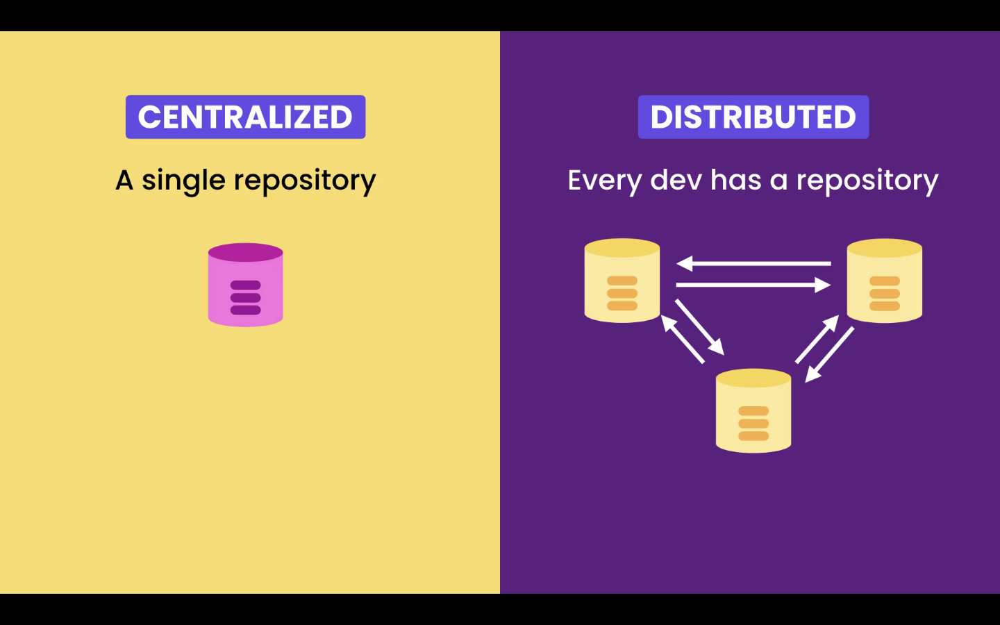
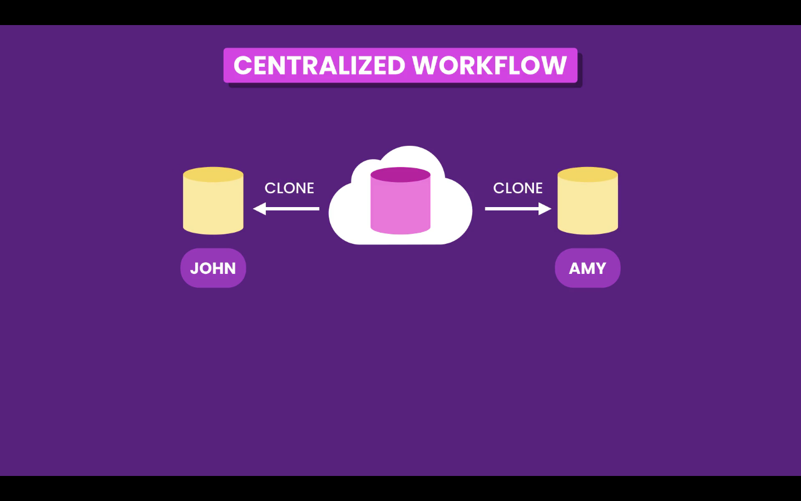
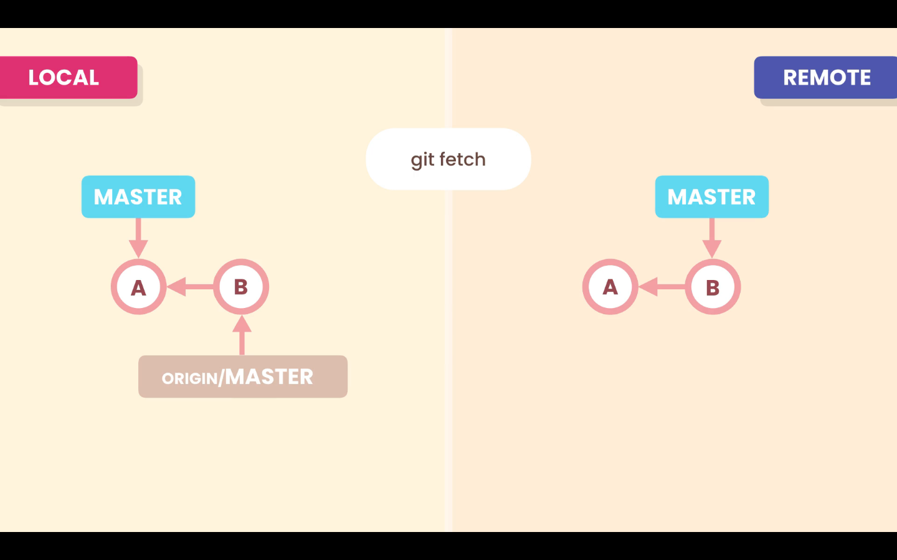
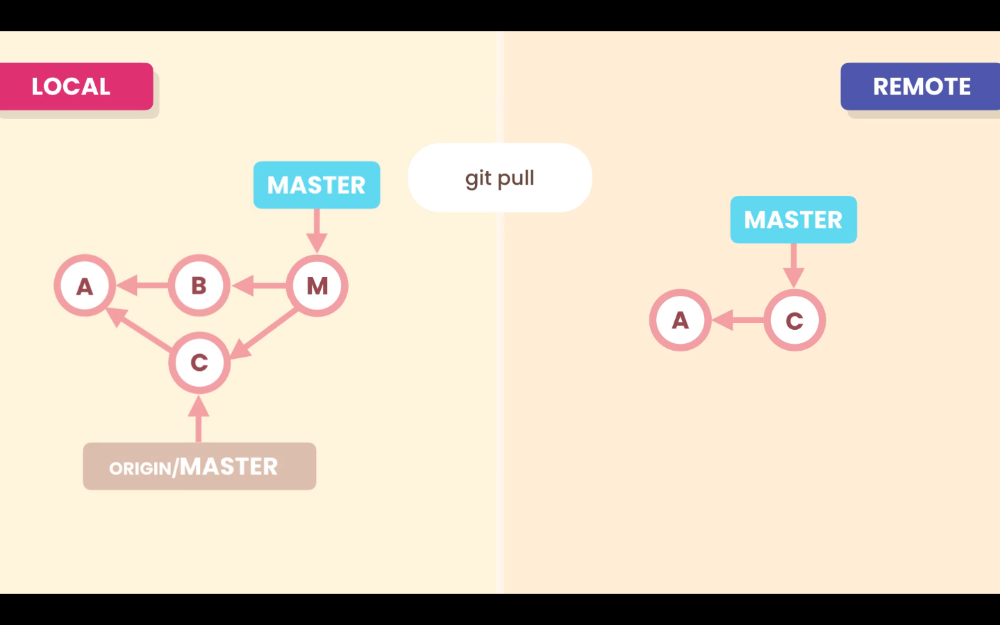

# 01- Introduction

In this section we will go through:

1. Collaboration workflows
2. Pushing, fetching and pulling
3. Pull requests, issues and milestones
4. Contributing to open-source projects.
# 02- Workflows

With a distributed VCS like Git it would be possible for each developer to synchronize his work with each member of the team.



But, usually, this is not the best solution, it's to complex and more susceptible to errors. Instead it is better to use, what is called, a **Centralized Workflow**, each developer still keeps a full local copy of the repository, but instead of syncing with each other they sync with a **Remote Repository**.


With this model we don't have a single point of failure. If the **Remote Repository** fails we still can sync the repository with each other.

**Remote Repository** examples:

- Company private servers
- Cloud hosting services
  - [GitHub](https://github.com/)
  - [GitLab](https://gitlab.com/)
  - [Bitbucket](https://bitbucket.org/)
  - etc...

## Centralized Workflow

The collaborating workflow usually follows this steps.

### 1. Clone the Remote Repository

First team members clone the repository from the **Remote Repository**. By cloning, tey will have a full copy of the repository on their machine.



### 2. Push to Remote Repository

Team members start working and commit to their **Local Repository**. At any time they can use the **`push`** command to sync (upload) their work to the **Remote Repository**, so it is shared with team members.


### 3. Pull from Remote Repository

Any other team member can use the **`pull`** command to bring (download) new changes to their **Local Repository**.


## Workflow for open-source projects

In a open-source project, usually only the maintainers have push access to the original **Remote Repository**. Other developers that want to contribute to the project first have to **fork** the **Remote Repository**, in order to have a copy of it.

Afterwards a contributor developer can clone the clone the repository and start working.


When he is done we can **`push`** is changes to the forked **Remote Repository**, and then send a **Pull Request** to the maintainers of the project. Who are notified, and can pull and review the changes. And if they agree with the changes they can merge them with the original **Remote Repository**.


# 05- Cloning a Repository

To clone a repository we need the repository url. For example: **_`https://github.com/jmschp/mosh-ultimate-git-course.git`_**.

Then in our machine we run the command `git clone <url>`, this will create a local copy of the repository. This command only copies the **_`main`_** branch, which is the default branch, even if there are other branches in the **Remote Repository**.

```zsh
❯ git clone https://github.com/jmschp/mosh-ultimate-git-course.git
Cloning into 'mosh-ultimate-git-course'...
remote: Enumerating objects: 489, done.
remote: Counting objects: 100% (489/489), done.
remote: Compressing objects: 100% (308/308), done.
remote: Total 489 (delta 236), reused 422 (delta 169), pack-reused 0
Receiving objects: 100% (489/489), 5.90 MiB | 1.71 MiB/s, done.
Resolving deltas: 100% (236/236), done.
```

## Changing the default directory

When using the `clone` command Git will create a directory with the same name of the repository. In ths case `mosh-ultimate-git-course`. We can change it by passing a new name after the url `git clone <url> <my-folder>`

```zsh
git clone https://github.com/jmschp/mosh-ultimate-git-course.git mosh-git
```

The above command will copy the repository to a new folder called `mosh-git`.

## Remote Repository

When we clone a **Remote Repository**, in this case from GitHub, Git names this source repository **_`origin`_**.

```zsh
❯ git log --oneline --graph
* 0065a18 (HEAD -> main, origin/main, origin/HEAD) start new lesson
* 488cbba lesson complete
* 910d1d3 renamed folder
* a32bc1f style: removed white spaces
* 2d4c7af fixed merge conflict
* 5a090b1 rename file
```

### Reference `origin/main`

The **_`origin/main`_** pointer, tell us where is the **_`main`_** branch in the **Remote Repository**. If we start to work and commit to the **Local Repository**, this one will move forward, but **_`origin/main`_**, will stay here it is until we push our work.

Technically this is called a remote tracking branch, we can not switch to it or commit to it.

### List remote repositories

We can have more than one **Remote Repositories**, with the command `git remote` we can list all the **Remote Repositories** connected to our **Local Repository**.

```zsh
❯ git remote -v
origin  https://github.com/jmschp/mosh-ultimate-git-course.git (fetch)
origin  https://github.com/jmschp/mosh-ultimate-git-course.git (push)
```

Using the `-v` option we get a more verbose output, showing more details. In this example we only hev one **Remote Repository**.
# 06- Fetching

The **Local Repository** and **Remote Repository** work independently. If we have new commits in our **Remote Repository**, because another team member pushed is work, our **Local Repository** will not be aware of it.

We have to use the `git fetch <remote-repository>` command to download the new commits. When we do so the **_`origin/main`_** pointer will move forward, and point to the new commits. But our working directory will not be updated

```zsh
git fetch origin
```

Optionally we can specify a branch to the `fetch` command, like `git fetch <remote-repository> <branch-name>`.

```zsh
git fetch origin bugfix
```



To update our branch with the changes downloaded from the `fetch` command, we have to merge them with our branch, with the command:

```zsh
git merge origin/master
```


## Remote and Local branches

With the command `git branch -vv` we can se how the remote and local branches are diverging.

```zsh
❯ git branch -vv
* main bbe3812 [origin/main: ahead 2] add details to lesson
```

In the above output from the `git branch -vv` we can see that our local **_`main`_** branch is connect to the remote **_`origin/main`_** branch. And the local branch is ahead by 2 commits.
# 07- Pulling

## `git pull`

The `pull` command combines the `fetch` and `merge` together. With this command Git will download the commits in the **Remote Repository** branch and merge them with the **Local Repository** branch.



By default Git will perform a fast-forward merge if possible, if it is not possible like in the image above, git will run a 3-way merge.

## `git pull --rebase`

With the command `git pull --rebase` Git will rebase **Local Repository** branch on top of the **Remote Repository** branch.


# 08- Pushing

With the `git push <remote-repository> <name-of-branch>` command we can send (upload) our changes to the **Remote Repository**.

```zsh
❯ git push origin main
Enumerating objects: 30, done.
Counting objects: 100% (30/30), done.
Delta compression using up to 8 threads
Compressing objects: 100% (24/24), done.
Writing objects: 100% (25/25), 649.54 KiB | 19.68 MiB/s, done.
Total 25 (delta 11), reused 0 (delta 0), pack-reused 0
remote: Resolving deltas: 100% (11/11), completed with 3 local objects.
To https://github.com/jmschp/mosh-ultimate-git-course.git
   0065a18..a170331  main -> main
```

It is also possible to abbreviate this command and only run `git push`, by default Git assumes the **Remote Repository** **_`origin`_**, and it will also assume teh current branch.

## Reject push

In some situations our `push` may be rejected. For example if some team member pushed before us. So the **Remote Repository** and **Local Repository** histories have diverged.

To resolve this, first we have to `pull` the **Remote Repository** and merge the changes, and them we can `push`.
# 09- Storing Credentials

We can store the credentials for access to the **Remote Repository**, and tell git where to find them. For this we can set `credential.helper` in the configuration.

## Cache

With the `cache` configuration Git will save the credentials for 15 minutes in memory.

```zsh
git config --global credential.helper cache
```

## MacOs

We can use macOS keychain, to permanently store our credential. First run the following commando to know if the macOS keychain helper is installed.

```zsh
❯ git credential-osxkeychain
usage: git credential-osxkeychain <get|store|erase>
```

If it is installed we can set it, with the following command, if not Git will give us instructions on how to install it.

```zsh
git config --global credential.helper osxkeychain
```
# 10- Sharing Tags

## Push tag

By default the `push` command does not transfer tags to the **Remote Repository**. We have to explicit `push` them, with the command `git push origin <tag-name>`.

```zsh
git push origin v1.0
```

## Deleted pushed tag

To delete an already pushed tag from the **Remote Repository**, we use the command `git push origin --delete <tag-name>`.

```zsh
git push origin --delete v1.0
```

This only deletes the tag from the **Remote Repository**, it will still be present in the **Local Repository**.
# 12- Sharing Branches

## Push branch to **Remote Repository**

When we create a new branch it will only be available in our **Local Repository**. If we want to share our branches with team members we have to `push` them to the **Remote Repository**.

If we try to `push` a branch, that it is not in the **Remote Repository**, with `git push`, we will get an error.

For example I have created a branch named `bugfix` and tried to `push` it. Git will throw an error:

```zsh
❯ git push
fatal: The current branch bugfix has no upstream branch.
To push the current branch and set the remote as upstream, use

    git push --set-upstream origin bugfix
```

The error message **_`The current branch bugfix has no upstream branch.`_** means that this branch is not linked to a remote tracking branch in origin, if we run `git branch -vv`, we can see this.

```zsh
❯ git branch -vv
* bugfix 9edbb2f lesson complete
  main   9edbb2f [origin/main] lesson complete
```

To set the remote tracking branch we run the command Git suggested `git push --set-upstream origin <name-of-branch>`, we only have to pass `--set-upstream` option the first time.

We can abbreviate the option `--set-upstream` to `-u`.

```zsh
❯ git push -u origin bugfix
Enumerating objects: 7, done.
Counting objects: 100% (7/7), done.
Delta compression using up to 8 threads
Compressing objects: 100% (4/4), done.
Writing objects: 100% (4/4), 1.56 KiB | 1.56 MiB/s, done.
Total 4 (delta 2), reused 0 (delta 0), pack-reused 0
remote: Resolving deltas: 100% (2/2), completed with 2 local objects.
remote:
remote: Create a pull request for 'bugfix' on GitHub by visiting:
remote:      https://github.com/jmschp/mosh-ultimate-git-course/pull/new/bugfix
remote:
To https://github.com/jmschp/mosh-ultimate-git-course.git
 * [new branch]      bugfix -> bugfix
Branch 'bugfix' set up to track remote branch 'bugfix' from 'origin'.
```

And them again `git branch -vv` to see the result.

```zsh
❯ gb -vv
* bugfix 9edbb2f [origin/bugfix] lesson complete
  main   9edbb2f [origin/main] lesson complete
```

## Delete a branch from **Remote Repository**

To delete a branch from the **Remote Repository** we run `git push -d origin <name-of-branch>`. This will only detete the branch in the **Remote Repository**, it will still be available in the **Local Repository**.

```zsh
git push -d origin bugfix
```

We can check with `git branch -vv`.

```zsh
❯ gb -vv
* bugfix 133c99c [origin/bugfix: gone] add details to lesson
  main   9edbb2f [origin/main] lesson complete
```
# 13- Collaboration Workflow

For this example I have created a new branch directly on GitHub, we can use the `fetch` command to download this new branch.

```zsh
❯ git fetch
From https://github.com/jmschp/mosh-ultimate-git-course
 * [new branch]      feature    -> origin/feature
```

When we run `fetch` we got a remote tracking branch. We can run `git branch` to list all the local branches, but this new fetched branch will not be displayed, because it is a remote tracking branch. We can see it with `git branch -r`

```zsh
❯ git branch -r
  origin/HEAD -> origin/main
  origin/feature
  origin/main
```

Now we can create a new local branch that maps to this remote tracking branch. To do that we use the the following command, `git switch -c <local-branch> <remote-tracking-branch>`.

```zsh
❯ git switch -c feature origin/feature
Branch 'feature' set up to track remote branch 'feature' from 'origin'.
Switched to a new branch 'feature'
```

After all team members have set up the branch in their local machine, they can collaborate in this branch.

If one team member deletes this branch from the **Remote Repository**, other team member will still have the the remote tracking branch in their machine. To remve remote tracking branches that are not in the **Remote Repository**, run `git remote prune <remote-repository>`.

```zsh
git remote prune origin
```
# 20- Keeping a Forked Repository Up to Date

## Add a **Remote Repository**

To keep a fork up to date we can add a remote repository linked to the original repository. To do that we use the `remote` command. With `git remote -v` we can list all the **Remote Repositories**. To add a new remote we use the `add` command, like so `git remote add <remote-name> <url>`. We can name the **Remote Repository** what ever we want, but in this situations is is usually called `upstream`.

```zsh
git remote add upstream https://github.com/username/repository-name.git
```

## Rename a **Remote Repository**

To rename a remote repository use the `rename` command, `git remote rename <remote-old-name> <remote-new-name>`.

```zsh
git remote rename upstream base
```

In this example we rename the **Remote Repository** `upstream` to `base`.

## Removing a **Remote Repository**

To remove a remote **Remote Repository** we use the `rm` command. `git remote rm <remote-name>`

```zsh
git remote rm base
```
