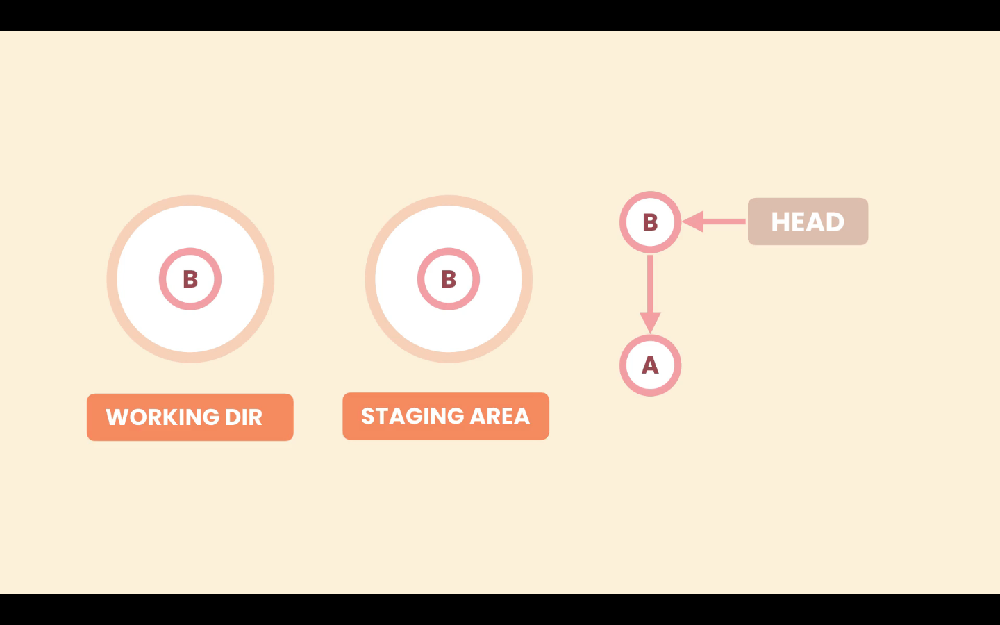

# 01- Introduction

In this section we will go through:

1. Why and when to rewrite history
2. Undo or revert commits
3. Use interactive rebasing
4. Recover lost commits
# 02- Why Rewrite History

## Why do we need the history?

With Git history we can see:

- What was changed
- Why it was changed
- When it was changed

## Bad commits

Bad commits make it difficult to read the project history.

- Poor commits messages, with no meaning
- To large commits, with unrelated changes
- To small commits, scattered all over the history

We need a clean history to be ale to see how our project evolved from day one.

## Tools

To make our history cleaner we can use several Git operations.

- Squash small, related commits
- Slipt large commits with unrelated changes
- Reword commits messages
- Drop unwanted commits
- Modify the content of a commit
# 03- The Golden Rule of Rewriting History

**_Don't rewrite public history_**

This rules means that commits that have been pushed to a public repository, and shared with other developers should not be modified.
# 04- Example of a Bad History

As an example of bad history:

```zsh
❯ git log --oneline --graph
* 088455d (HEAD -> master) .
* f666091 WIP
* 111bd75 Update terms of service and Google Map SDK version.
* 72856ea WIP
* 8441b05 Add a reference to Google Map SDK.
* 8527033 Change the color of restaurant icons.
* af26a96 Fix a typo.
* 6fb2ba7 Render restaurants the map.
* 70ef834 Initial commit
```

Commit:

- `6fb2ba7 Render restaurants the map.` -> Wording issue should be `"...restaurants on the map."``
- `af26a96 Fix a typo.` -> We shouldn't have a typo in the first place, commits like these pollute the history. So we can combine them with other commit.
- `8527033 Change the color of restaurant icons.` -> This part of the of the same line of work in the restaurants, So all this commits should be combined.
- `8441b05 Add a reference to Google Map SDK.` -> The problem here is that if we checkout commit `6fb2ba7`, our application is not going to work, because the Google Map SD reference comes afterwards. We should either move this commit down before `6fb2ba7`, or combine both commits.
- `72856ea WIP` -> A "Work In Progress" commit it is just a noisy commit, we Should either drop it, change the message or combine it.
- `111bd75 Update terms of service and Google Map SDK version.` -> Ideally we should separate these commit in tow commits, Because updating terms of service, as nothing to do with updating google map SDK.
- `088455d (HEAD -> master) .` -> A mysterious message commit, we should either drop it or change this message.
# 05- Undoing Commits

As we seen before if we have pushed a commit to a public **Remote Repository** we should not remove it.

```zsh
❯ git log --oneline --graph
* 088455d (HEAD -> master) .
* f666091 WIP
* 111bd75 Update terms of service and Google Map SDK version.
* 72856ea WIP
* 8441b05 Add a reference to Google Map SDK.
* 8527033 Change the color of restaurant icons.
* af26a96 Fix a typo.
* 6fb2ba7 Render restaurants the map.
* 70ef834 Initial commit
```

For example if we want to undo the last commit `088455d (HEAD -> master) .` we have two options:

1. Revert commit -> The has been pushed to a public **Remote Repository**
2. Reset commit -> The has not been pushed to a public **Remote Repository**

## Reset commit

Resetting a commit removes this commit from the history. We use the `reset` command and we have to give it the target commit. We can do that using the `HEAD~n` syntax, which means `n` commits back from the commit `HEAD` is pointing to usually the last commit.

```zsh
git reset --hard HEAD~1
```

### Options to the reset command

We have the following options:

- `--soft` -> Removes the commit only
- `--mixed` -> Unstages files
- `--hard` -> Discards local changes

For example, let's say we have two commits in our **Local Repository** `A` and `B`, and `B` is the last commit because `HEAD` is pointing to it. In the **Staging Area** and **Working Directory** we have the same code as in the last snapshot (**Local Repository**).



#### Option --soft

The `--soft` option only changes the **Local Repository**. Removes the commit only.

If we use `git reset --soft HEAD~1`, Git will point `HEAD` to the target location, in the **Local Repository**, but it is not going to touch the **Staging Area** and **Working Directory**.


This is the same state as before we committed `B`. We have some changes in the **Staging Area** and **Working Directory**, that have not yet been committed.

#### Option --mixed

The `--mixed` option will change the **Local Repository** and the **Staging Area**. We go one step back, it will unstage the changes.

With the `--mixed` option Git will move the `HEAD` pointer, from `A` to `B` as in the `--soft` option, and will put the last snapshot in the **Staging Area** as well, but it will not touch the **Working Directory**.


This is the same state as before we staged our changes. We have some changes in the **Working Directory**, that have not yet been staged.

#### Option --hard

The `--hard` option will change the **Local Repository**, **Staging Area**, and the **Working Directory**. Even one more step back, discards local changes.

With the `--hard` option Git will move the `HEAD` pointer, from `A` to `B` as in the `--soft` option, and it will put the last snapshot in the **Staging Area** and the **Working Directory**. So the new changes in the **Working Directory** are gone.


# 06- Reverting Commits

In case we have pushed our commits to a public **Remote Repository** we should not use the `reset` command. We should use the `revert` command, this will create a new commit base on our target commit.

## Revert one commit

To revert a single commit we pass that commit to the revert command. Either by the commit ID or by the `HEAD~n` syntax. This will create new commit.

History before revert:

```zsh
❯ git log --oneline --graph
* 088455d (HEAD -> master) .
* f666091 WIP
* 111bd75 Update terms of service and Google Map SDK version.
* 72856ea WIP
* 8441b05 Add a reference to Google Map SDK.
* 8527033 Change the color of restaurant icons.
* af26a96 Fix a typo.
* 6fb2ba7 Render restaurants the map.
* 70ef834 Initial commit
```

```zsh
❯ git revert HEAD~1
[master 1b7aed7] Revert "WIP"
 1 file changed, 1 deletion(-)
```

History after revert:

```zsh
❯ git log --oneline --graph
* 1b7aed7 (HEAD -> master) Revert "WIP"
* 088455d .
* f666091 WIP
* 111bd75 Update terms of service and Google Map SDK version.
* 72856ea WIP
* 8441b05 Add a reference to Google Map SDK.
* 8527033 Change the color of restaurant icons.
* af26a96 Fix a typo.
* 6fb2ba7 Render restaurants the map.
* 70ef834 Initial commit
```

The above command reverts the last commit, so it will create a new commit undoing the changes made by the last commit.

## Revert a range of commits

We can revert a range of commits using the `..` notation, like:

```zsh
git revert HEAD~4..HEAD
```

or

```zsh
git revert 8441b05..1b7aed7
```

Note that the first commit `HEAD~4` or `111bd75`, in the above example are not included.

This operation will create a new commit for each commit reverted.

History before revert:

```zsh
❯ git log --oneline --graph
* 088455d (HEAD -> master) .
* f666091 WIP
* 111bd75 Update terms of service and Google Map SDK version.
* 72856ea WIP
* 8441b05 Add a reference to Google Map SDK.
* 8527033 Change the color of restaurant icons.
* af26a96 Fix a typo.
* 6fb2ba7 Render restaurants the map.
* 70ef834 Initial commit
```

History after revert:

```zsh
❯ git log --oneline --graph
* 645357e (HEAD -> master) Revert "WIP"
* 685ec4e Revert "Update terms of service and Google Map SDK version."
* 6a65dda Revert "WIP"
* a0262f0 Revert "."
* 088455d .
* f666091 WIP
* 111bd75 Update terms of service and Google Map SDK version.
* 72856ea WIP
* 8441b05 Add a reference to Google Map SDK.
* 8527033 Change the color of restaurant icons.
* af26a96 Fix a typo.
* 6fb2ba7 Render restaurants the map.
* 70ef834 Initial commit
```

### Range revert with single commit `--no-commit`

Instead of creating one new commit for each reverted commit (which might pollute the history) we can use the option `--no-commit`, that will create only one commit, for all the reverted commits. With this options Git will add the required changes to the **Staging Area**, for each reverted commit.

```zsh
git revert --no-commit HEAD~4..HEAD
```

If we run `git status`, we can see the changes of the reverse of the last 4 commits.

```zsh
❯ git status
On branch master
You are currently reverting commit 72856ea.
  (all conflicts fixed: run "git revert --continue")
  (use "git revert --skip" to skip this patch)
  (use "git revert --abort" to cancel the revert operation)

Changes to be committed:
  (use "git restore --staged <file>..." to unstage)
    modified:   map.txt
    modified:   package.txt
    deleted:    terms.txt
```

If we are happy with the changes we use the `--continue` option.

```zsh
git revert --continue
```

Or if we want to abort we use th `--abort` option.

```zsh
git revert --abort
```

History after revert:

```zsh
❯ git log --oneline --graph
* b7ed3ee (HEAD -> master) Revert last 4 commits
* 088455d .
* f666091 WIP
* 111bd75 Update terms of service and Google Map SDK version.
* 72856ea WIP
* 8441b05 Add a reference to Google Map SDK.
* 8527033 Change the color of restaurant icons.
* af26a96 Fix a typo.
* 6fb2ba7 Render restaurants the map.
* 70ef834 Initial commit
```
# 07- Recovering Lost Commits

With the `reflog` command we can see a log of how a reference (or pointer) as moved in our history. If we do not supply any options we will see how the `HEAD` pointer moved in history.  `git reflog <reference>`

```zsh
❯ git reflog
088455d (HEAD -> master) HEAD@{0}: reset: moving to HEAD~1
b7ed3ee HEAD@{1}: commit: Revert last 4 commits
088455d (HEAD -> master) HEAD@{2}: reset: moving to HEAD~4
645357e HEAD@{3}: revert: Revert "WIP"
685ec4e HEAD@{4}: revert: Revert "Update terms of service and Google Map SDK version."
6a65dda HEAD@{5}: revert: Revert "WIP"
a0262f0 HEAD@{6}: revert: Revert "."
088455d (HEAD -> master) HEAD@{7}: reset: moving to
[...]
088455d (HEAD -> master) HEAD@{27}: commit: .
f666091 HEAD@{28}: commit: WIP
111bd75 HEAD@{29}: commit: Update terms of service and Google Map SDK version.
72856ea HEAD@{30}: commit: WIP
8441b05 HEAD@{31}: commit: Add a reference to Google Map SDK.
8527033 HEAD@{32}: commit: Change the color of restaurant icons.
af26a96 HEAD@{33}: commit: Fix a typo.
6fb2ba7 HEAD@{34}: commit: Render restaurants the map.
70ef834 HEAD@{35}: commit (initial): Initial commit
```

Every entry of the `reflog` command starts with the commit `HEAD` is point to after the operation, then a unique identifier. In this example we have `HEAD@{0}` for the first entry, `HEAD@{1}` for the second entry, and so on. In front of the identifier we see what happened.

| Commit ID | Identifier | Message                 |
| :-------: | :--------: | :---------------------- |
|  645357e  |  HEAD@{1}  | reset: moving to HEAD~4 |

So we can revert any of theses operations to recover lost commits. In this example the operation `HEAD@{0}` is resetting `HEAD~1`. We can recover the lost commit with the `reset` command. We can use the identifier or the the commit ID

History before:

```zsh
❯ git log --all --oneline --graph
* 088455d (HEAD -> master) .
* f666091 WIP
* 111bd75 Update terms of service and Google Map SDK version.
* 72856ea WIP
* 8441b05 Add a reference to Google Map SDK.
* 8527033 Change the color of restaurant icons.
* af26a96 Fix a typo.
* 6fb2ba7 Render restaurants the map.
* 70ef834 Initial commit
```

```zsh
❯ git reset --hard HEAD@{1}
HEAD is now at b7ed3ee Revert last 4 commits
```

History after:

```zsh
❯ git log --all  --oneline --graph
* b7ed3ee (HEAD -> master) Revert last 4 commits
* 088455d .
* f666091 WIP
* 111bd75 Update terms of service and Google Map SDK version.
* 72856ea WIP
* 8441b05 Add a reference to Google Map SDK.
* 8527033 Change the color of restaurant icons.
* af26a96 Fix a typo.
* 6fb2ba7 Render restaurants the map.
* 70ef834 Initial commit
````
# 08- Amending the Last Commit

In situations where we made a mistake in the last commit, like a typo in the message, or adding a file that shouldn't be there, we can amend the commit. We don't actually modify the last commit, in really Git creates a new commit, because git commits are immutable.

## Amend a commit message or include changes

With the `--amend` option we can add more changes to the last commit or modify the commit message. In case we need to add more changes in the code to the last commit, first we need to stage them and the run `git commit --amend -m <message>`. Optionally we can omit the message and accept the last message, so run `git commit --amend` will open the default editor with the previous commit message.

```zsh
git commit --amend
```

## Remove a file from the last commit

To remove a file from the last commit, first we need to use the `reset` command with the `--mixed` option, `git reset --mixed HEAD~1`. With this command Git will unstage our changes, but the **Working Directory** will not be affected.

Then we can restage the changed we need and perform a normal commit.

```zsh
git reset --mixed HEAD~1

git add <files>

git commit -m <commit message>
```

Here we do not use the `--amend` option, because we have reseated the `HEAD`, so the last commit is not there anymore.
# 09- Amending an Earlier Commit

To amend an earlier commit we use interactive rebasing. With rebasing we can replay other commits on top of a commit. First we choose the commit we need to amend and pass it parent to the `rebase` command with the `-i` option, like `git rebase -i <commit>`.

We can modify one or more commits. Git will recreate each commit that goes through the rebase operation even if the are not edit.


In the above image suppose we only changed commit `B`, Git will recreate `C` and `D` to point not the new `B` commit.

Rebasing is a destructive operation because it rewrites history.

The `-i` option means we are going to interact with the rebase operation, stop it, make changes, continue it or abort it.

This command will open de default editor with a script, listing all the commits we need to rebase, and instructions to perform the `rebase` operation. Just like the following example:

```zsh
pick 8f1440a Add a reference to Google Map SDK.
pick 098a4bc Render restaurants the map.
pick 0bf60fe Fix a typo.
pick dd8f07e Change the color of restaurant icons.
pick ba55176 Update terms of service and Google Map SDK version.
pick f820221 WIP
pick 65dbb96 .

# Rebase 70ef834..65dbb96 onto 70ef834 (7 commands)
#
# Commands:
# p, pick <commit> = use commit
# r, reword <commit> = use commit, but edit the commit message
# e, edit <commit> = use commit, but stop for amending
# s, squash <commit> = use commit, but meld into previous commit
# f, fixup <commit> = like "squash", but discard this commit's log message
# x, exec <command> = run command (the rest of the line) using shell
# b, break = stop here (continue rebase later with 'git rebase --continue')
# d, drop <commit> = remove commit
# l, label <label> = label current HEAD with a name
# t, reset <label> = reset HEAD to a label
# m, merge [-C <commit> | -c <commit>] <label> [# <oneline>]
# .       create a merge commit using the original merge commit's
# .       message (or the oneline, if no original merge commit was
# .       specified). Use -c <commit> to reword the commit message.
#
# These lines can be re-ordered; they are executed from top to bottom.
#
# If you remove a line here THAT COMMIT WILL BE LOST.
#
# However, if you remove everything, the rebase will be aborted.
#
```

After configuring the script the rebase operations starts.

```zsh
❯ git rebase -i 8527033
Stopped at 8441b05...  Add a reference to Google Map SDK.
You can amend the commit now, with

  git commit --amend '-S'

Once you are satisfied with your changes, run

  git rebase --continue
```

Here we can make the necessary changes, and then amend the commit. when we are done we run `git rebase --continue`, to continue the operation.

To abort the rebase operation in any point use the `--abort` option. `git rebase --abort`.

In a rebase operation, a change introduced in a earlier commit will be carried on thought the history.
# 10- Dropping Commits

To drop commits we use interactive `rebase` operation. So we have to pass to the `rebase` operation the parent of the commit we want to drop, like `git rebase- i <parent-commit>`.

In interactive `rebase` operations conflicts might arise. For this example we want to drop the commit `72856ea`, but this commit introduces a new file that is used in the next commit `111bd75`, so this will provoque a conflict.

```zsh
❯ git log --oneline --graph --all
* b7ed3ee (HEAD -> master) Revert last 4 commits
* 088455d .
* f666091 WIP
* 111bd75 Update terms of service and Google Map SDK version.
* 72856ea WIP
* 8441b05 Add a reference to Google Map SDK.
* 8527033 Change the color of restaurant icons.
* af26a96 Fix a typo.
* 6fb2ba7 Render restaurants the map.
* 70ef834 Initial commit
```

To select the parent of commit `72856ea`, we can use several syntaxes, `72856ea~1`, or `72856ea^`. When we run the interactive `rebase` operations, and select `drop` in the script operation, we will be prompt with the conflict warning message.

```git
❯ git rebase -i 72856ea~1
CONFLICT (modify/delete): terms.txt deleted in HEAD and modified in 111bd75 (Update terms of service and Google Map SDK version.). Version 111bd75 (Update terms of service and Google Map SDK version.) of terms.txt left in tree.
error: could not apply 111bd75... Update terms of service and Google Map SDK version.
Resolve all conflicts manually, mark them as resolved with
"git add/rm <conflicted_files>", then run "git rebase --continue".
You can instead skip this commit: run "git rebase --skip".
To abort and get back to the state before "git rebase", run "git rebase --abort".
Could not apply 111bd75... Update terms of service and Google Map SDK version.
```

In the short status we can see the `terms.txt` file as two changes `D` for `deleted`, because the rebase operations drops the commit where the file was introduced, and `M` for `modified`, because these file is modified in the next commit.

```zsh
❯ git status -s
M  package.txt
DU terms.txt
```

To resolve this conflict we use the `mergetool` command.

```zsh
❯ g mergetool

This message is displayed because 'merge.tool' is not configured.
See 'git mergetool --tool-help' or 'git help config' for more details.
'git mergetool' will now attempt to use one of the following tools:
tortoisemerge emerge vimdiff nvimdiff
Merging:
terms.txt

Deleted merge conflict for 'terms.txt':
  {local}: deleted
  {remote}: modified file
Use (m)odified or (d)eleted file, or (a)bort?
```

In this case we want the `m` option for modified. Then we continue the rebase operation, with `git rebase --continue`.
# 11- Rewording Commit Messages

To reword commits we also use the interactive `rebase` operation, and in the script choose the `reword` option.

For each commit we want to reword, Git will open the default editor and give us a chance to rewrite the commit message.
# 12- Reordering Commits

To reorder commits we use the interactive `rebase` operation, all we have to do is change the commits order in the script's operation.

# 13- Squashing Commits

## Squash rebase

To squash commits together we use the interactive `rebase` operation. In the rebase script we select the `squash` option only for the child commits, the parent commit keeps the `pick` option. All commits that need to be squash have to be in sequence, so if needed we can reorder them first.

```zsh
pick 098a4bc Render restaurants the map.
squash 0bf60fe Fix a typo.
squash dd8f07e Change the color of restaurant icons.
pick ba55176 Update terms of service and Google Map SDK version.
pick f820221 WIP
pick 65dbb96 .
```

In the above example commits `098a4bc`, `0bf60fe` and `dd8f07e`, will be combined together. After combined the commits, the rebase operation will open the default editor to edit the commit message.

## Fixup rebase

The `fixup` rebase option works like `squash` option, but instead of allowing us to edit the commit message, it will use the message form the parent squashed commit, in this case the message from commit `098a4bc`.

```zsh
pick 098a4bc Render restaurants the map.
pick fixup Fix a typo.
pick fixup Change the color of restaurant icons.
pick ba55176 Update terms of service and Google Map SDK version.
pick f820221 WIP
pick 65dbb96 .
```
# 14- Splitting a Commit

To split a commit we use the interactive `rebase` operation. We pass to the rebase operation the parent of the commit we need to split. In the script we select the `edit` option for the commit we need to split.

Then in the `rebase` operation we unstage the changes of the commit with `git reset --mixed HEAD^`. Now the changes applied in this commit ar in our **Working Directory**.

With the unstaged changes we slipt the commit to our needs with normal `git add <file>` and `git commit -m <message>`. This will create new commits. Then continue the `rebase` operation to finish `git rebase --continue`.
